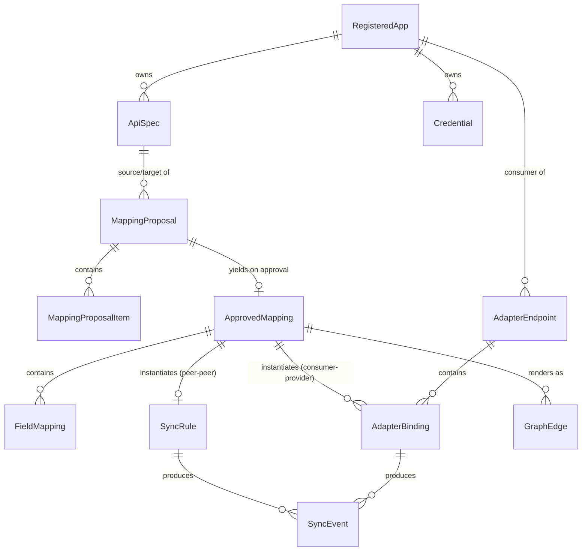

# Logical Data Model

This is a conceptual entity/relationship model, not a schema — it stays deliberately independent of any specific database technology, consistent with the stack-agnostic architecture (see [overview.md](overview.md)).

## Entities

### RegisteredApp

An application in the landscape. An app can carry a `PROVIDER` spec (an API it exposes), a `CONSUMER` spec (what it wants from the landscape), or both.

- `id`, `name`, `status` (active/disabled)
- `baseUrl` — optional. Absent for apps that only registered a `CONSUMER` spec, since in that case the mediator itself hosts the reachable endpoint (see [adapter-engine.md](adapter-engine.md)).
- `capabilities`: `{ supportsWebhooks: bool, supportsPolling: bool, defaultPollInterval }` — declared at registration, drives which sync transport(s) apply (see [sync-engine.md](sync-engine.md)).
- `createdAt`

### ApiSpec

- `id`, `appId`, `role` (`PROVIDER` | `CONSUMER`)
- `rawDocument` — the original OpenAPI document
- `parsedIR` — normalized Intermediate Representation (resources → operations → schemas), see [mapping-engine.md](mapping-engine.md)
- `version` (monotonic integer), `contentHash`, `status` (active/superseded)
- `createdAt`

### Credential

- `id`, `appId`, `type` (apiKey / oauth2 / basicAuth / webhookSecret / custom)
- `encryptedPayload` (envelope-encrypted, see [security.md](security.md))
- `scopes`, `lastRotatedAt`

### MappingProposal

The output of one Mapping Engine run over a pair of specs.

- `id`, `sourceSpecId`, `targetSpecId`
- `generatedBy`: `{ providerId, model, promptVersion }` — which LLM provider/config produced this, for reproducibility
- `status` (pending / partially_approved / approved / rejected)
- `createdAt`
- has many `MappingProposalItem`

### MappingProposalItem

A single candidate correspondence within a proposal.

- `id`, `proposalId`, `kind` (`operation` | `field`)
- `sourceRef`, `targetRef`
- `transformSuggestion`
- `confidenceScore` (0–1)
- `ambiguousAlternatives[]` — other plausible targets, each with its own confidence
- `rationale` — short explanation from the LLM
- `reviewState` (pending / accepted / edited / rejected)

### ApprovedMapping

The reviewed, human-approved result — the only thing the Sync Engine and Adapter Engine ever act on.

- `id`, `sourceAppId`, `targetAppId`, `sourceSpecVersion`, `targetSpecVersion`
- `direction` (oneway A→B / oneway B→A / bidirectional)
- `approvedBy`, `approvedAt`
- `status` (active / suspended / stale — `stale` is set by the breaking-change flow, see [extensibility.md](extensibility.md))
- has many `FieldMapping`

### FieldMapping

- `id`, `mappingId`, `sourcePath`, `targetPath`
- `transform` (rename / coerce / aggregate / expression), `transformConfig`
- optional `conflictPolicy` override (`manual-resolve`, see [sync-engine.md](sync-engine.md))

### SyncRule

Instantiated only for peer-to-peer `ApprovedMapping`s (both sides `PROVIDER` specs).

- `id`, `approvedMappingId`
- `transport` (webhook / poll / both), `direction`
- `pollIntervalOverride`, `webhookSubscriptionRef`
- `status` (enabled/disabled), `lastRunAt`, `lastEventAt`, `cursor` (for delta polling)

### AdapterEndpoint

Instantiated only for consumer-provider `ApprovedMapping`s. One per operation in a `CONSUMER` spec.

- `id`, `consumerAppId`, `consumerOperationId`
- `aggregationStrategy` (single / fanout-merge / fanout-first-success / collection-union)
- `cacheTtl`
- has many `AdapterBinding`

### AdapterBinding

- `id`, `adapterEndpointId`, `backendAppId`, `backendOperationId`, `approvedMappingId`
- `role` (primary / fallback / supplement)

### GraphEdge (materialized projection)

- `id`, `sourceNodeId`, `targetNodeId`
- `type` (sync / adapter-dependency)
- `transport`, `status`
- `metadata` (last activity timestamp, direction)

### SyncEvent / AuditLog

- `id`, `type` (inbound-webhook / poll-run / outbound-call / adapter-request / mapping-decision / credential-access)
- `relatedRuleId` / `relatedBindingId`, `originAppId`
- `idempotencyKey`, `payloadHash`
- `status` (success / failure / skipped-loop / conflict)
- `timestamp`, `details`
- `traceId` / `spanId` — correlates this business record to the corresponding OpenTelemetry trace (see [observability.md](observability.md))

## Relationships

## Modeling notes

- **Consumer-only apps are still a `RegisteredApp`.** Rather than introduce a separate entity for "an app that only wants data," a consumer-only registration is simply a `RegisteredApp` with a `CONSUMER`-role `ApiSpec` and no `baseUrl` — the mediator becomes its reachable endpoint via the Adapter Engine. This keeps one entity model for "anything registered in the landscape," at the cost of `baseUrl` being conditionally meaningful.
- **`GraphEdge` is a materialized projection**, not a primary source of truth — it is derived from `ApprovedMapping` + `SyncRule`/`AdapterBinding` state and kept incrementally up to date as those change, so the graph overview stays fast to query without recomputing from scratch (see [flows/graph-overview.md](../flows/graph-overview.md)).
- **`SyncRule` and `AdapterEndpoint`/`AdapterBinding` are mutually exclusive outcomes of the same `ApprovedMapping`**: a peer-peer mapping (both sides `PROVIDER`) instantiates a `SyncRule`; a consumer-provider mapping instantiates `AdapterBinding`(s) under an `AdapterEndpoint`. Nothing instantiates both from the same mapping.
