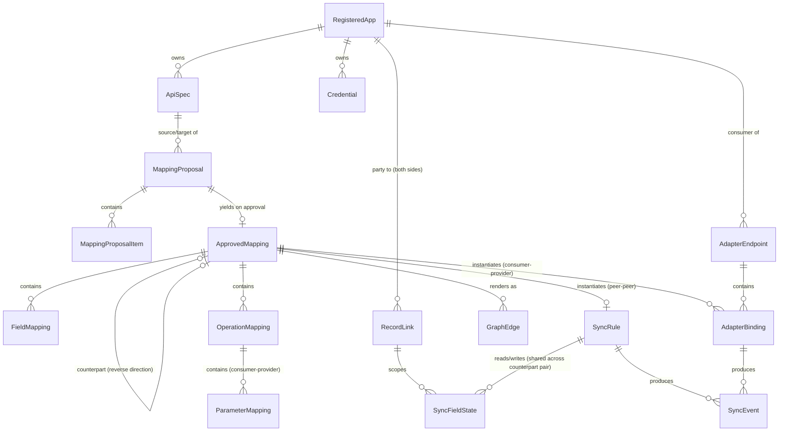

# Logical Data Model

This is a conceptual entity/relationship model, not a schema — it stays deliberately independent of any specific database technology, consistent with the stack-agnostic architecture (see [overview.md](overview.md)).

## Entities

### RegisteredApp

An application in the landscape. An app can carry a `PROVIDER` spec (an API it exposes), a `CONSUMER` spec (what it wants from the landscape), or both.

- `id`, `name`, `status` (active/disabled)
- `baseUrl` — optional. Absent for apps that only registered a `CONSUMER` spec, since in that case the mediator itself hosts the reachable endpoint (see [adapter-engine.md](adapter-engine.md)).
- `capabilities`: `{ supportsWebhooks: bool, webhookSetup: managed | manual, supportsPolling: bool, supportsDeltaQuery: bool, supportsChangeTimestamps: bool, defaultPollInterval }` — declared at registration. Drives which sync transport(s) apply, how webhook subscriptions get provisioned (`webhookSetup`, meaningful only when `supportsWebhooks` — see [sync-engine.md](sync-engine.md)), whether the Poller can use changed-since queries instead of full-fetch diffing, and whether conflict resolution may compare source change timestamps (`supportsChangeTimestamps`, see [sync-engine.md](sync-engine.md)).
- `createdAt`

### ApiSpec

- `id`, `appId`, `role` (`PROVIDER` | `CONSUMER`)
- `rawDocument` — the original OpenAPI document
- `parsedIR` — normalized Intermediate Representation (resources → operations → schemas), see [mapping-engine.md](mapping-engine.md)
- `version` (monotonic integer), `contentHash`, `status` (active/superseded)
- `createdAt`

### Credential

- `id`, `appId`, `type` (apiKey / oauth2 / basicAuth / webhookSecret / custom)
- `encryptedPayload` (envelope-encrypted, see [security.md](security.md))
- `scopes`, `lastRotatedAt`

### MappingProposal

The output of one Mapping Engine run over a pair of specs.

- `id`, `sourceSpecId`, `targetSpecId`
- `generatedBy`: `{ providerId, model, promptVersion }` — which LLM provider/config produced this, for reproducibility; `promptVersion` covers both stage prompts (shortlist + detail, see [mapping-engine.md](mapping-engine.md))
- `shortlistResult` — the validated stage-1 `ResourceShortlist` this proposal was scoped by: the candidate resource pairs, plus the resources with no shortlisted counterpart. Persisted for review transparency and the manual "analyze this resource pair anyway" escape hatch (see [mapping-engine.md](mapping-engine.md)); computed once per unordered spec pair and shared by both directional proposals.
- `status` (pending / partially_approved / approved / rejected)
- `createdAt`
- has many `MappingProposalItem`

### MappingProposalItem

A single candidate correspondence within a proposal.

- `id`, `proposalId`, `kind` (`operation` | `field` | `parameter`) — `parameter` items exist only on consumer-provider proposals (see [mapping-engine.md](mapping-engine.md))
- `sourceRef`, `targetRef` — `targetRef` is nullable: absent when `unmapped = true`
- `phase` (`request` | `response`) — only on `kind = field` items of consumer-provider proposals; absent on peer-peer proposals. `parameter` items are inherently request-phase and carry no `phase` field.
- `transformSuggestion` — populated for `kind = field` and `kind = parameter`; null for `kind = operation`
- `confidenceScore` (0–1)
- `ambiguousAlternatives[]` — other plausible targets, each with its own confidence; applies to both `operation`- and `field`-kind items (an operation can have more than one plausible match, same as a field)
- `unmapped` (bool) — true when no counterpart was found for this source element; `targetRef` and `transformSuggestion` are absent in that case and the item is surfaced as "needs manual mapping or is intentionally unmapped"
- `rationale` — short explanation from the LLM
- `reviewState` (pending / accepted / edited / rejected)

### ApprovedMapping

The reviewed, human-approved result — the only thing the Sync Engine and Adapter Engine ever act on. Its core invariant: **every transform executes only in its declared direction — nothing is ever run in reverse.** For a **peer-peer** mapping this makes the mapping one-directional as a whole (`sourceSpecId → targetSpecId`, data flowing source → target); there is no "bidirectional" value — see *Bidirectional mappings are two `ApprovedMapping`s* below for how two-way sync is represented. A **consumer-provider** mapping always runs consumer = `sourceSpecId`, provider = `targetSpecId` — the consumer spec is the *virtual provider* the mediator hosts, and the mediator never calls the consumer (see [adapter-engine.md](adapter-engine.md)) — and covers one request round trip via two independent transform phases: request (consumer → backend) and response (backend → consumer). See `FieldMapping.phase` and `ParameterMapping` below.

- `id`
- `sourceSpecId`, `targetSpecId` — pins the exact `ApiSpec` row (app + role + version) on each side. This is the field that disambiguates an app that carries both a `PROVIDER` and a `CONSUMER` spec, whose versions increment independently — a bare app id + version number cannot tell those apart. Pinning is *maintained* by the spec-update lifecycle: when a new spec version is ingested, active mappings unaffected by the change are mechanically **re-pinned** to the new version, while mappings hit by a breaking change go `stale` and stay pinned to the version they were reviewed against (see [extensibility.md](extensibility.md)). Invariant: an `active` mapping always points at the currently active `ApiSpec` version.
- `sourceAppId`, `targetAppId` — denormalized from the specs above, for query convenience only; `sourceSpecId`/`targetSpecId` are the source of truth.
- `counterpartMappingId` — optional, nullable, **peer-peer only**: a consumer-provider mapping has no reverse direction, since the mediator never calls the consumer. Set when the reverse-direction `ApprovedMapping` between the same two **spec lineages** (app + role, version-agnostic — see [extensibility.md](extensibility.md)) has also been approved; the two rows point at each other. Lineage identity, not exact version identity, is what makes the link stable while the two specs' versions advance independently under re-pinning. This is how "bidirectional sync" is represented: as a pairing of two independently-proposed, independently-reviewed, independently-transformed one-way mappings, not as a single entity with an inherently reversible transform (see the modeling note below on why).
- `approvedBy`, `approvedAt` — the *most recent* approval action; the full history of partial approvals and edits lives in the Audit Log's `mapping-decision` events (see [security.md](security.md)), so incremental approval doesn't need history fields here.
- `status` (active / suspended / stale — `stale` is set by the breaking-change flow, see [extensibility.md](extensibility.md))
- has many `FieldMapping` and many `OperationMapping`

### FieldMapping

- `id`, `mappingId`, `sourcePath`, `targetPath` — resource-qualified IR paths. `sourcePath` is always the transform's **input**, `targetPath` its **output**; on a peer-peer mapping both follow the mapping's single data direction (source app → target app), on a consumer-provider mapping `phase` (below) fixes which spec each side lives in.
- `phase` (`request` | `response`) — **consumer-provider mappings only**; required there, absent on peer-peer rows. `request`: consumer request field in, backend request field out. `response`: backend response field in, consumer response field out. The two phases are independent, separately-reviewed transform sets — never inverses of each other (see the modeling notes below and [adapter-engine.md](adapter-engine.md)).
- `transform` (rename / coerce / aggregate / expression), `transformConfig` — `expression` executes in a sandboxed, non-Turing-complete evaluator (see [security.md](security.md))
- `isIdentityKey` (bool) — marks this field pair as the **identity key** of its resource pair: the business-level field (e.g. email, SKU, external reference number) whose values identify the *same record* in both apps. Exactly one confirmed identity `FieldMapping` per mapped resource pair is required before a `SyncRule` over that resource can be enabled — see *Identity correlation* in [sync-engine.md](sync-engine.md). Suggested by the Mapping Engine (`identityCandidate`, see [mapping-engine.md](mapping-engine.md)) but only ever set by explicit reviewer confirmation. Like `conflictPolicy` below, it is only meaningful on peer-peer mappings — the Adapter Engine transforms individual requests/responses and never correlates records across apps.
- optional `conflictPolicy` override (`manual-resolve`, see [sync-engine.md](sync-engine.md)) — **meaningful only when `mappingId` refers to a peer-peer (sync-driving) `ApprovedMapping`**; a consumer-provider `ApprovedMapping` has no notion of "conflict" (the Adapter Engine resolves live, there is nothing to reconcile against), so this field is unused on those rows. Same conditionally-meaningful shape as `RegisteredApp.baseUrl` (see the modeling notes below).

### OperationMapping

One approved operation-level correspondence under an `ApprovedMapping` — the persisted form of an accepted `kind = operation` `MappingProposalItem`, exactly as `FieldMapping` is the persisted form of an accepted `kind = field` item. This is what tells the executing engines *which target operation to call*:

- the Sync Engine selects the target operation whose `action` matches the change type it is propagating (create/update/delete — see *Change types* in [sync-engine.md](sync-engine.md));
- the Adapter Engine chooses `AdapterBinding.backendOperationId` from the approved `OperationMapping`s of the binding's `approvedMappingId` (see [flows/adapter-endpoint-composition.md](../flows/adapter-endpoint-composition.md)).

Fields:

- `id`, `mappingId`, `sourceOperationRef`, `targetOperationRef`
- `action` (`create` | `read` | `update` | `delete`) — classified mechanically from the target operation's IR (HTTP method + path shape) at approval time, correctable by the reviewer when the heuristic gets it wrong (see [flows/mapping-review-and-approval.md](../flows/mapping-review-and-approval.md))

### ParameterMapping

One approved operation-input correspondence under a **consumer-provider** `ApprovedMapping` — how the Adapter Engine fills a backend operation's parameters (path/query/header) from the consumer's inbound request. Parameters are inherently per-operation, unlike resource fields, so these rows hang off the `OperationMapping` that pairs the two operations rather than off the resource-level `FieldMapping` set. Peer-peer mappings have no `ParameterMapping`s: the sync pipeline fills target operation parameters (e.g. the path id of an update) from the `RecordLink`, not from a mapping.

- `id`, `operationMappingId`
- `sourceParamRef` (consumer operation parameter), `targetParamRef` (backend operation parameter)
- optional `transform` / `transformConfig` — same transform vocabulary and sandboxing as `FieldMapping` (see [security.md](security.md))

### SyncRule

Instantiated only for peer-to-peer `ApprovedMapping`s (both sides `PROVIDER` specs). Exactly one `SyncRule` per `ApprovedMapping` — since `ApprovedMapping` is always one-directional (see above), `SyncRule` has no separate `direction` field of its own; it simply runs in the direction of the mapping it instantiates from (`sourceSpecId`'s app → `targetSpecId`'s app). A bidirectional sync between two apps is two `SyncRule`s, one per paired `ApprovedMapping` — which also means each direction can independently pick its own transport based on its own source app's `capabilities` (e.g. A→B over webhook because A supports webhooks, B→A over polling because B only supports polling).

- `id`, `approvedMappingId`
- `transport` (webhook / poll / both)
- `pollIntervalOverride`, `webhookSubscriptionRef`
- `deletePropagation` (`ignore` | `propagate`, default `ignore`) — whether a detected source-side deletion is propagated to the target. Deletion is the one destructive operation the mediator can perform against an app, so it is opt-in per rule; ignored deletions are still recorded (`SyncEvent.status = skipped-policy`), never silently dropped. See *Change types* in [sync-engine.md](sync-engine.md).
- `backfillMode` (`link-only` | `push`), `backfillStatus` (`pending` | `running` | `completed` | `skipped`) — the one-time initial reconciliation performed before the rule's transports go live; see *Initial backfill* in [sync-engine.md](sync-engine.md).
- `status` (enabled/disabled), `lastRunAt`, `lastEventAt`, `cursor` (for delta polling) — a rule cannot be enabled until its `ApprovedMapping` has a confirmed identity `FieldMapping` per mapped resource pair **and** its backfill has completed or been explicitly skipped.
- `lastSnapshotRef` — reference to the per-record content-hash snapshot (record native id → hash) from the last complete full fetch; what the Poller diffs against when the source app doesn't support delta queries (see [sync-engine.md](sync-engine.md)).

### AdapterEndpoint

Instantiated only for consumer-provider `ApprovedMapping`s. One per `CONSUMER`-spec operation that has at least one approved binding — created when the first mapping covering that operation is approved, then updated (never duplicated) as further mappings attach bindings to it; see [flows/adapter-endpoint-composition.md](../flows/adapter-endpoint-composition.md).

- `id`, `consumerAppId`, `consumerOperationId`
- `aggregationStrategy` (single / fanout-merge / fanout-first-success / collection-union)
- `cacheTtl`
- `status` (`active` | `composition-required` | `disabled`) — `composition-required` means a newly approved mapping attached a candidate binding to an endpoint that already had one, and a human must decide the aggregation strategy/roles before the new binding participates; the endpoint keeps serving its previous active configuration in the meantime. See [flows/adapter-endpoint-composition.md](../flows/adapter-endpoint-composition.md).
- has many `AdapterBinding`

### AdapterBinding

- `id`, `adapterEndpointId`, `backendAppId`, `backendOperationId`, `approvedMappingId` — `backendOperationId` is chosen from the approved `OperationMapping`s of `approvedMappingId`, not free-form
- `role` (primary / fallback / supplement) — which roles are meaningful depends on the parent `AdapterEndpoint.aggregationStrategy`; see the role-validity table in [adapter-engine.md](adapter-engine.md).
- `status` (`active` | `proposed` | `disabled`) — `proposed` means the binding was attached by a mapping approval but has not yet been composed into the endpoint's active configuration (see [flows/adapter-endpoint-composition.md](../flows/adapter-endpoint-composition.md)).
- `executionOrder` (int, default 0), `dependsOnBindingId` (optional) — bindings with the same `executionOrder` run in parallel; a binding with `dependsOnBindingId` set runs only after that binding completes and receives its response as input (the "one backend's output feeds another's input" case). Both fields are strategy-scoped: under `fanout-first-success` the order is a strict total order (ties are invalid) and `dependsOnBindingId` doesn't apply — see the validity rules in [adapter-engine.md](adapter-engine.md).

### RecordLink

The persisted correspondence between one record's native identity in app A and the same logical record's native identity in app B. Two independently-owned apps assign their own primary ids — nothing guarantees they agree — so the pairing must be recorded explicitly: update routing, conflict detection, delete propagation, and delete-echo detection all depend on it (see *Identity correlation* in [sync-engine.md](sync-engine.md)). Scoped to the unordered app pair, like `SyncFieldState` (which is keyed by it), so it is shared by both directions of a bidirectional pair.

- `id`
- `appAId`, `appANativeId`, `appBId`, `appBNativeId` — the two apps' own record identifiers
- `resourcePairRef` — the mapped resource pair (source/target IR resource groups) this link correlates
- `establishedBy` (`create-propagation` | `identity-match` | `manual`) — captured from a create response, matched via the confirmed identity `FieldMapping` (during backfill or steady state), or linked explicitly in the UI
- `status` (`active` | `tombstoned`) — a link is tombstoned, not deleted, when either side's record is deleted: the tombstone is what recognizes the other side's delete echo and prevents a slower poll cycle from resurrecting the record (see [sync-engine.md](sync-engine.md))
- `createdAt`, `tombstonedAt`

### SyncFieldState

Tracks the last-reconciled value of one mapped field for one linked record — the state conflict detection compares incoming changes against (see [sync-engine.md](sync-engine.md)). Keyed by the field pairing itself, not by a single `SyncRule`, so a conflict is detected correctly regardless of which direction wrote last — the same state is shared by both `SyncRule`s of a bidirectional pair.

- `id`
- `recordLinkId` — the cross-app record identity this state applies to; the link carries both apps' native ids (see `RecordLink` above)
- `appAFieldPath`, `appBFieldPath` — the unordered field pairing this state tracks (the apps themselves are given by the `RecordLink`)
- `lastSyncedValueHash`, `lastSyncedAt` — the last-reconciled value, hashed from the target's **canonical stored representation** (taken from the write response body, or a follow-up read when the API doesn't return the stored resource) so target-side normalization doesn't defeat echo detection (see *Loop prevention* in [sync-engine.md](sync-engine.md)). Absent when initial backfill found the two sides already divergent for this field; the first subsequent change is then a conflict by construction (see *Initial backfill* in [sync-engine.md](sync-engine.md))
- `sideAObservedHash`, `sideBObservedHash` (each with an `observedAt`) — the latest value hash the mediator has *observed* on each side, updated from every webhook, poll result, and write response that touches the field; conflict detection compares these against `lastSyncedValueHash` to decide whether a side has drifted since the last reconcile (see [sync-engine.md](sync-engine.md))
- `lastWrittenByMappingId` — the `ApprovedMapping` (direction) that produced the last write, for audit/debugging

### GraphEdge (materialized projection)

- `id`, `sourceNodeId`, `targetNodeId`
- `type` (sync / adapter-dependency)
- `transport`, `status`
- `metadata` (last activity timestamp, direction)

### SyncEvent / AuditLog

- `id`, `type` (inbound-webhook / poll-run / backfill-run / outbound-call / adapter-request / mapping-decision / credential-access)
- `relatedRuleId` / `relatedBindingId`, `originAppId`
- `idempotencyKey`, `payloadHash`
- `status` (success / failure / skipped-loop / skipped-policy / conflict) — `skipped-policy` records a change observed but not propagated by policy, e.g. a deletion under `deletePropagation = ignore`
- `timestamp`, `details`
- `traceId` / `spanId` — correlates this business record to the corresponding OpenTelemetry trace (see [observability.md](observability.md))

## Relationships

## Modeling notes

- **Consumer-only apps are still a `RegisteredApp`.** Rather than introduce a separate entity for "an app that only wants data," a consumer-only registration is simply a `RegisteredApp` with a `CONSUMER`-role `ApiSpec` and no `baseUrl` — the mediator becomes its reachable endpoint via the Adapter Engine. This keeps one entity model for "anything registered in the landscape," at the cost of `baseUrl` being conditionally meaningful.
- **`ApprovedMapping` is always one-directional; bidirectional sync is two of them, paired.** Candidate generation already analyzes a peer pair in both directions as two separate `MappingProposal`s (see [mapping-engine.md](mapping-engine.md)); approving each one independently yields two one-way `ApprovedMapping`s, cross-linked via `counterpartMappingId` once both exist. This deliberately avoids the alternative of a single entity with an inherently-reversible transform: transforms like `aggregate` or `expression` (e.g. `fullName = firstName + " " + lastName`) have no well-defined inverse, so a genuine "reverse direction" has to be its own independently-proposed, independently-reviewed mapping — which might use a completely different transform, or might leave some fields intentionally `unmapped` in that direction. This also removes the need for a `direction` field on `SyncRule` (see below) and resolves what would otherwise be an ambiguous "which way does this `FieldMapping`'s `sourcePath`/`targetPath` go" question once a mapping is bidirectional. The same no-inversion argument fixes the **consumer-provider** shape from the other side: the adapter must transform in *both* halves of a round trip to serve even one call (request in, response out), so a consumer-provider mapping can't be one transform set used both ways — it carries two (`FieldMapping.phase = request | response`), proposed and reviewed together. It stays *one* mapping rather than two half-approvable ones (unlike a sync pair) because a request phase without its response phase serves nothing: the round trip is a single contract, and the mediator never calls the consumer, so there is no independent reverse relationship to represent.
- **`FieldMapping` is shared by both engines, but not every field on it is.** `FieldMapping` rows exist under both peer-peer and consumer-provider `ApprovedMapping`s, but `conflictPolicy` only has an effect on the former and `phase` only on the latter — each engine's fields are inert on the other's rows; the same conditionally-meaningful-field shape as `baseUrl` above, called out explicitly here rather than left implicit. (`AdapterBinding.role`/`executionOrder`, by contrast, live on an entity that only ever exists for consumer-provider mappings in the first place, so there's no analogous ambiguity there.)
- **`GraphEdge` is a materialized projection**, not a primary source of truth — it is derived from `ApprovedMapping` + `SyncRule`/`AdapterBinding` state and kept incrementally up to date as those change, so the graph overview stays fast to query without recomputing from scratch (see [flows/graph-overview.md](../flows/graph-overview.md)). Its `metadata.direction` is read directly off the single `ApprovedMapping.sourceSpecId → targetSpecId` it renders; a bidirectional pair renders as two directed edges (or one bidirectional edge rendering, at the UI's discretion) since it is backed by two `ApprovedMapping` rows.
- **`SyncRule` and `AdapterEndpoint`/`AdapterBinding` are mutually exclusive outcomes of the same `ApprovedMapping`**: a peer-peer mapping (both sides `PROVIDER`) instantiates a `SyncRule`; a consumer-provider mapping instantiates `AdapterBinding`(s) under an `AdapterEndpoint`. Nothing instantiates both from the same mapping.
- **Approved operation-level items persist as `OperationMapping`s, not just review metadata.** Approval turns `kind = field` items into `FieldMapping`s and `kind = operation` items into `OperationMapping`s. Without the latter, "call the mapped operation" ([sync-engine.md](sync-engine.md)) would have no persisted referent — the Sync Engine selects the target operation by matching the change's `action` (create/update/delete), and `AdapterBinding.backendOperationId` is chosen from the same rows rather than free-form.
- **`RecordLink` exists because native ids differ.** Nothing guarantees two independently-owned apps use the same primary id for the same logical record, so no single `resourceId` value can name a record on both sides. The link is written at create-propagation time (capturing the target's new id from the create response), by identity-key match (backfill or steady state), or manually; `SyncFieldState` is scoped to it. Links are tombstoned rather than deleted so delete echoes and record resurrection stay detectable (see [sync-engine.md](sync-engine.md)).
- **The identity key is a role on `FieldMapping` (`isIdentityKey`), not a separate entity** — an identity key *is* a field correspondence; only its function is special. It is another conditionally-meaningful field in this model (peer-peer mappings only), alongside `baseUrl`, `conflictPolicy`, and `FieldMapping.phase`, and the only one that requires explicit human confirmation rather than defaulting (see [flows/mapping-review-and-approval.md](../flows/mapping-review-and-approval.md)) — a wrong identity key silently merges unrelated records, the worst failure mode the Sync Engine has.
