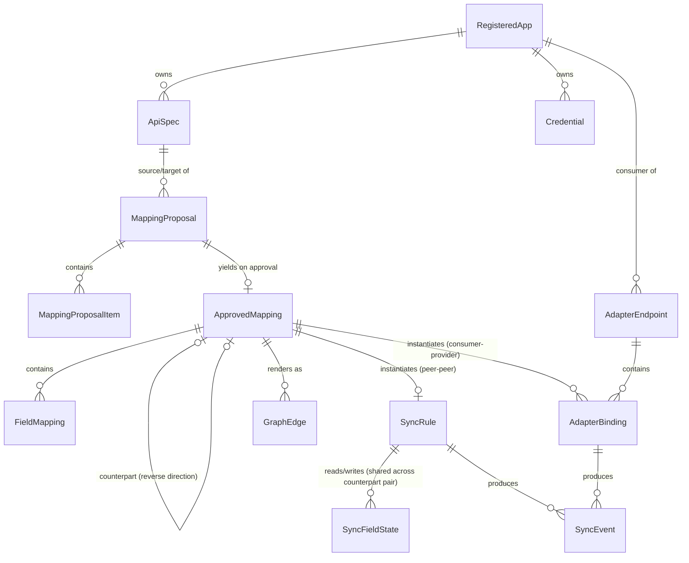

# Logical Data Model

This is a conceptual entity/relationship model, not a schema — it stays deliberately independent of any specific database technology, consistent with the stack-agnostic architecture (see [overview.md](overview.md)).

## Entities

### RegisteredApp

An application in the landscape. An app can carry a `PROVIDER` spec (an API it exposes), a `CONSUMER` spec (what it wants from the landscape), or both.

- `id`, `name`, `status` (active/disabled)
- `baseUrl` — optional. Absent for apps that only registered a `CONSUMER` spec, since in that case the mediator itself hosts the reachable endpoint (see [adapter-engine.md](adapter-engine.md)).
- `capabilities`: `{ supportsWebhooks: bool, supportsPolling: bool, supportsDeltaQuery: bool, defaultPollInterval }` — declared at registration, drives which sync transport(s) apply and whether the Poller can use changed-since queries instead of full-fetch diffing (see [sync-engine.md](sync-engine.md)).
- `createdAt`

### ApiSpec

- `id`, `appId`, `role` (`PROVIDER` | `CONSUMER`)
- `rawDocument` — the original OpenAPI document
- `parsedIR` — normalized Intermediate Representation (resources → operations → schemas), see [mapping-engine.md](mapping-engine.md)
- `version` (monotonic integer), `contentHash`, `status` (active/superseded)
- `createdAt`

### Credential

- `id`, `appId`, `type` (apiKey / oauth2 / basicAuth / webhookSecret / custom)
- `encryptedPayload` (envelope-encrypted, see [security.md](security.md))
- `scopes`, `lastRotatedAt`

### MappingProposal

The output of one Mapping Engine run over a pair of specs.

- `id`, `sourceSpecId`, `targetSpecId`
- `generatedBy`: `{ providerId, model, promptVersion }` — which LLM provider/config produced this, for reproducibility
- `status` (pending / partially_approved / approved / rejected)
- `createdAt`
- has many `MappingProposalItem`

### MappingProposalItem

A single candidate correspondence within a proposal.

- `id`, `proposalId`, `kind` (`operation` | `field`)
- `sourceRef`, `targetRef` — `targetRef` is nullable: absent when `unmapped = true`
- `transformSuggestion` — only populated for `kind = field`; null for `kind = operation`
- `confidenceScore` (0–1)
- `ambiguousAlternatives[]` — other plausible targets, each with its own confidence; applies to both `operation`- and `field`-kind items (an operation can have more than one plausible match, same as a field)
- `unmapped` (bool) — true when no counterpart was found for this source element; `targetRef` and `transformSuggestion` are absent in that case and the item is surfaced as "needs manual mapping or is intentionally unmapped"
- `rationale` — short explanation from the LLM
- `reviewState` (pending / accepted / edited / rejected)

### ApprovedMapping

The reviewed, human-approved result — the only thing the Sync Engine and Adapter Engine ever act on. **Always one-directional**: `sourceSpecId → targetSpecId`. There is no "bidirectional" value — see *Bidirectional mappings are two `ApprovedMapping`s* below for how two-way sync is represented.

- `id`
- `sourceSpecId`, `targetSpecId` — pins the exact `ApiSpec` row (app + role + version) on each side. This is the field that disambiguates an app that carries both a `PROVIDER` and a `CONSUMER` spec, whose versions increment independently — a bare app id + version number cannot tell those apart.
- `sourceAppId`, `targetAppId` — denormalized from the specs above, for query convenience only; `sourceSpecId`/`targetSpecId` are the source of truth.
- `counterpartMappingId` — optional, nullable. Set when the reverse-direction `ApprovedMapping` between the same two specs has also been approved; the two rows point at each other. This is how "bidirectional sync" is represented: as a pairing of two independently-proposed, independently-reviewed, independently-transformed one-way mappings, not as a single entity with an inherently reversible transform (see the modeling note below on why).
- `approvedBy`, `approvedAt`
- `status` (active / suspended / stale — `stale` is set by the breaking-change flow, see [extensibility.md](extensibility.md))
- has many `FieldMapping`

### FieldMapping

- `id`, `mappingId`, `sourcePath`, `targetPath`
- `transform` (rename / coerce / aggregate / expression), `transformConfig`
- optional `conflictPolicy` override (`manual-resolve`, see [sync-engine.md](sync-engine.md)) — **meaningful only when `mappingId` refers to a peer-peer (sync-driving) `ApprovedMapping`**; a consumer-provider `ApprovedMapping` has no notion of "conflict" (the Adapter Engine resolves live, there is nothing to reconcile against), so this field is unused on those rows. Same conditionally-meaningful shape as `RegisteredApp.baseUrl` (see the modeling notes below).

### SyncRule

Instantiated only for peer-to-peer `ApprovedMapping`s (both sides `PROVIDER` specs). Exactly one `SyncRule` per `ApprovedMapping` — since `ApprovedMapping` is always one-directional (see above), `SyncRule` has no separate `direction` field of its own; it simply runs in the direction of the mapping it instantiates from (`sourceSpecId`'s app → `targetSpecId`'s app). A bidirectional sync between two apps is two `SyncRule`s, one per paired `ApprovedMapping` — which also means each direction can independently pick its own transport based on its own source app's `capabilities` (e.g. A→B over webhook because A supports webhooks, B→A over polling because B only supports polling).

- `id`, `approvedMappingId`
- `transport` (webhook / poll / both)
- `pollIntervalOverride`, `webhookSubscriptionRef`
- `status` (enabled/disabled), `lastRunAt`, `lastEventAt`, `cursor` (for delta polling)

### AdapterEndpoint

Instantiated only for consumer-provider `ApprovedMapping`s. One per operation in a `CONSUMER` spec.

- `id`, `consumerAppId`, `consumerOperationId`
- `aggregationStrategy` (single / fanout-merge / fanout-first-success / collection-union)
- `cacheTtl`
- has many `AdapterBinding`

### AdapterBinding

- `id`, `adapterEndpointId`, `backendAppId`, `backendOperationId`, `approvedMappingId`
- `role` (primary / fallback / supplement) — which roles are meaningful depends on the parent `AdapterEndpoint.aggregationStrategy`; see the role-validity table in [adapter-engine.md](adapter-engine.md).
- `executionOrder` (int, default 0), `dependsOnBindingId` (optional) — bindings with the same `executionOrder` run in parallel; a binding with `dependsOnBindingId` set runs only after that binding completes and receives its response as input (the "one backend's output feeds another's input" case, see [adapter-engine.md](adapter-engine.md)).

### SyncFieldState

Tracks the last-reconciled value of one mapped field for one record — the state conflict detection compares incoming changes against (see [sync-engine.md](sync-engine.md)). Keyed by the field pairing itself, not by a single `SyncRule`, so a conflict is detected correctly regardless of which direction wrote last — the same state is shared by both `SyncRule`s of a bidirectional pair.

- `id`
- `appAId`, `appAFieldPath`, `appBId`, `appBFieldPath` — the unordered field pairing this state tracks
- `resourceId` — the record identity this state applies to, correlated across both apps via the pair's identifier `FieldMapping`
- `lastSyncedValueHash`, `lastSyncedAt`
- `lastWrittenByMappingId` — the `ApprovedMapping` (direction) that produced the last write, for audit/debugging

### GraphEdge (materialized projection)

- `id`, `sourceNodeId`, `targetNodeId`
- `type` (sync / adapter-dependency)
- `transport`, `status`
- `metadata` (last activity timestamp, direction)

### SyncEvent / AuditLog

- `id`, `type` (inbound-webhook / poll-run / outbound-call / adapter-request / mapping-decision / credential-access)
- `relatedRuleId` / `relatedBindingId`, `originAppId`
- `idempotencyKey`, `payloadHash`
- `status` (success / failure / skipped-loop / conflict)
- `timestamp`, `details`
- `traceId` / `spanId` — correlates this business record to the corresponding OpenTelemetry trace (see [observability.md](observability.md))

## Relationships

## Modeling notes

- **Consumer-only apps are still a `RegisteredApp`.** Rather than introduce a separate entity for "an app that only wants data," a consumer-only registration is simply a `RegisteredApp` with a `CONSUMER`-role `ApiSpec` and no `baseUrl` — the mediator becomes its reachable endpoint via the Adapter Engine. This keeps one entity model for "anything registered in the landscape," at the cost of `baseUrl` being conditionally meaningful.
- **`ApprovedMapping` is always one-directional; bidirectional sync is two of them, paired.** Candidate generation already analyzes a peer pair in both directions as two separate `MappingProposal`s (see [mapping-engine.md](mapping-engine.md)); approving each one independently yields two one-way `ApprovedMapping`s, cross-linked via `counterpartMappingId` once both exist. This deliberately avoids the alternative of a single entity with an inherently-reversible transform: transforms like `aggregate` or `expression` (e.g. `fullName = firstName + " " + lastName`) have no well-defined inverse, so a genuine "reverse direction" has to be its own independently-proposed, independently-reviewed mapping — which might use a completely different transform, or might leave some fields intentionally `unmapped` in that direction. This also removes the need for a `direction` field on `SyncRule` (see below) and resolves what would otherwise be an ambiguous "which way does this `FieldMapping`'s `sourcePath`/`targetPath` go" question once a mapping is bidirectional.
- **`FieldMapping` is shared by both engines, but not every field on it is.** `FieldMapping` rows exist under both peer-peer and consumer-provider `ApprovedMapping`s, but `conflictPolicy` only has an effect on the former — the same conditionally-meaningful-field shape as `baseUrl` above, called out explicitly here rather than left implicit. (`AdapterBinding.role`/`executionOrder`, by contrast, live on an entity that only ever exists for consumer-provider mappings in the first place, so there's no analogous ambiguity there.)
- **`GraphEdge` is a materialized projection**, not a primary source of truth — it is derived from `ApprovedMapping` + `SyncRule`/`AdapterBinding` state and kept incrementally up to date as those change, so the graph overview stays fast to query without recomputing from scratch (see [flows/graph-overview.md](../flows/graph-overview.md)). Its `metadata.direction` is read directly off the single `ApprovedMapping.sourceSpecId → targetSpecId` it renders; a bidirectional pair renders as two directed edges (or one bidirectional edge rendering, at the UI's discretion) since it is backed by two `ApprovedMapping` rows.
- **`SyncRule` and `AdapterEndpoint`/`AdapterBinding` are mutually exclusive outcomes of the same `ApprovedMapping`**: a peer-peer mapping (both sides `PROVIDER`) instantiates a `SyncRule`; a consumer-provider mapping instantiates `AdapterBinding`(s) under an `AdapterEndpoint`. Nothing instantiates both from the same mapping.
