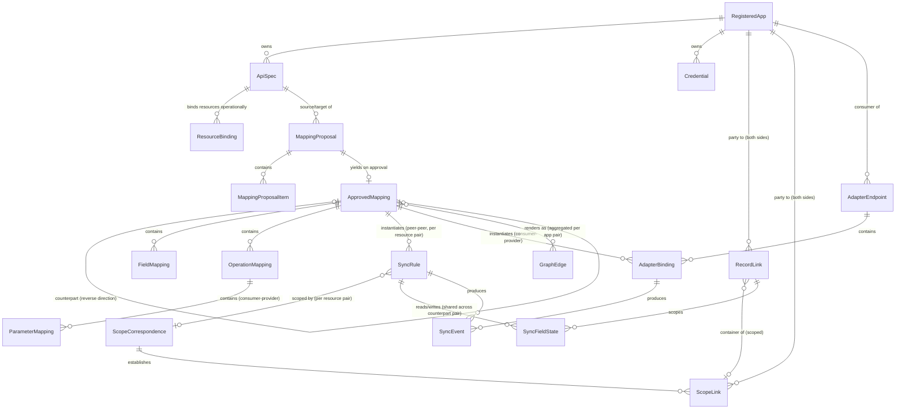

# Logical Data Model

This is a conceptual entity/relationship model, not a schema — it stays deliberately independent of any specific database technology, consistent with the stack-agnostic architecture (see [overview.md](overview.md)).

## Entities

### RegisteredApp

An application in the landscape. An app can carry a `PROVIDER` spec (an API it exposes), a `CONSUMER` spec (what it wants from the landscape), or both.

- `id`, `name`, `status` (active/disabled)
- `baseUrl` — optional. Absent for apps that only registered a `CONSUMER` spec, since in that case the mediator itself hosts the reachable endpoint (see [adapter-engine.md](adapter-engine.md)).
- `capabilities`: `{ supportsPolling: bool, supportsDeltaQuery: bool, supportsChangeTimestamps: bool, defaultPollInterval }` — declared at registration. Change detection is exclusively poll-based (see [sync-engine.md](sync-engine.md)), so `supportsPolling` decides whether the app can act as a sync *source* at all — an app that can be neither listed nor delta-queried can still be a sync *target* or an adapter backend; `supportsDeltaQuery` decides whether the Poller can use changed-since queries instead of full-fetch diffing; and `supportsChangeTimestamps` decides whether conflict resolution may compare source change timestamps (see [sync-engine.md](sync-engine.md)). These flags say what an app *can* do, declared at the app level — a flag need not hold for every resource (an app may declare `supportsDeltaQuery` while some resource offers no delta operation; the per-resource refs below, and `SyncRule.pollOperationRef`'s fallback to the collection read, are authoritative per resource). The concrete fields and parameters that execute the capabilities — native-id field, collection read, pagination parameters, delta cursor and its deletion reporting, change-timestamp field — are bound per resource via `ResourceBinding` below, since OpenAPI declares none of these conventions itself.
- `createdAt`

### ApiSpec

- `id`, `appId`, `role` (`PROVIDER` | `CONSUMER`)
- `rawDocument` — the original OpenAPI document
- `parsedIR` — normalized Intermediate Representation (resources → operations → schemas), see [mapping-engine.md](mapping-engine.md)
- `analysisExclusions[]` — resource refs the operator has excluded from mapping analysis (default: empty — every resource group is in scope). Settable at registration and editable any time; carried forward when a new spec version is ingested, like `ResourceBinding`s (a ref that no longer resolves is dropped). **Analysis-only semantics**: excluded resources are omitted from shortlist prompts and receive no detail calls, but existing proposals and `ApprovedMapping`s over them are unaffected; removing an exclusion triggers a scoped incremental analysis — see *Scoping down* in [mapping-engine.md](mapping-engine.md).
- `version` (monotonic integer), `contentHash`, `status` (active/superseded/archived) — `archived` when the owning app is deregistered: retained because archived mappings still pin it for audit (see *App lifecycle* in [extensibility.md](extensibility.md))
- `createdAt`

### ResourceBinding

The confirmed **operational bindings** for one resource of an `ApiSpec` — the concrete fields and parameters that make the app's declared `capabilities` executable against that resource. OpenAPI declares no convention for record ids, collection reads, pagination, delta cursors and their deletion reporting, change timestamps, the field(s) carrying a record's container scope, or how a resource's non-record-id (scope) path parameters are filled, so each ref is derived mechanically at ingestion by heuristic (a field named `id`, parameters named `page`/`cursor`/`limit`, a field named `updatedAt`, …) and confirmed or corrected by the operator — the same derive-then-correct pattern as `OperationMapping.action` and `FieldMapping.targetLookupParamRef`. (The one variation is `scopePathBindings` below, where the *set* of scope parameters is derived mechanically but each parameter's fill *source* is operator-chosen — a `constant` value being operator-authored content rather than a heuristic guess; its per-ref confirmation discipline is otherwise identical.) Bindings are carried forward when the spec version is re-pinned (see [extensibility.md](extensibility.md)); a breaking change touching a bound element returns that ref to unconfirmed.

- `id`, `apiSpecId`, `resourceRef`
- `nativeIdRef` — which field of the resource's representation carries a record's **native id**. Everything record-identity-shaped depends on it: snapshot keying (`native id → hash`), `RecordLink` native ids, and capturing a created record's new id from the create response. Must be confirmed before any `SyncRule` with this resource as source *or* target can be enabled.
- `collectionReadRef` — the resource's collection read (list) operation: what a full-fetch `SyncRule.pollOperationRef` pins by default, what backfill enumerates with, and what fetch-and-match fetches with (see [sync-engine.md](sync-engine.md)). Absent when the resource offers no collection read — a delta-only source (backfill can only be skipped) or a non-enumerable target (fetch-and-match unavailable). Must be confirmed wherever one of those uses applies.
- `paginationRef` — the collection read's paging parameters and exhaustion convention (e.g. offset/page parameter plus "empty page ends"). Absent means the collection read returns the full result in one response. Must be confirmed wherever polling, backfill, or fetch-and-match has to page this resource.
- `deltaCursorRef` — only meaningful when the app declares `supportsDeltaQuery`: the delta operation's cursor/changed-since request parameter, plus where in the response the next cursor value is found. Must be confirmed before a delta-polling `SyncRule` on this resource can be enabled.
- `deltaDeletionRef` — only meaningful when the app declares `supportsDeltaQuery`: how the delta response reports deletions — a per-record deletion-marker field or a separate deleted-ids list. Delta polling without this ref confirmed cannot detect deletions at all: `deletePropagation = propagate` cannot be enabled on a delta-polling rule until it is (see *Change types* in [sync-engine.md](sync-engine.md)).
- `changeTimestampRef` — only meaningful when the app declares `supportsChangeTimestamps`: which field of the resource carries a record's change timestamp. Captured into `SyncFieldState.observedChangeTimestamp` on every observation and compared by last-write-wins conflict resolution (see [sync-engine.md](sync-engine.md)); while unconfirmed, conflict resolution falls back to observation order exactly as if the capability were absent.
- `sourceScopeRef` — **only meaningful when the resource can act as a scoped sync *source***: which field(s) of the resource's record representation carry its **container identity**, so the Poller can capture each record's scope directly from the record it already fetched (a Gitea issue's `repository.owner` + `repository.name`, a Vikunja task's `project_id`) instead of a separate per-record lookup. Modeled as a small **keyed set of scope components**, each `{ key, fieldPath }`: `key` is a stable component name (defaulting to the `fieldPath`'s leaf segment, operator-correctable) and `fieldPath` an IR field path into the resource's response schema; a single-field container yields one component, a multi-field container (Gitea `owner` + `name`) one per field. Derived-unconfirmed at ingestion and validated against the response schema like every other ref; **absent** when the resource's records carry no container field (record-derived scope is then unavailable — a `constant` or `scope-link` binding is the only option). Reading a source record through it yields that record's **captured scope** — the `{ key → value }` map (Gitea `{ owner, name }`, Vikunja `{ project }`) — which travels **with the detected change** through the sync pipeline as an in-flight attribute (alongside its native id, action, and content), *not* as new persisted sync state, so the Poller keeps its single per-rule `cursor`/snapshot: a `record-derived` `scopePathBindings` entry on the *target* resource reads it (by `sourceScopeKey`) to fill a target scope parameter, and under multi-scope sync scoped record identity keys its match by it (see [sync-engine.md](sync-engine.md)). Distinct from the `record-derived` binding's `sourceScopeKey`, which *selects* one captured component rather than *defining* the capture. Unconfirmed → used nowhere.
- `scopePathBindings` — how the resource's **non-record-id path parameters** are filled: the *scope* parameters that locate a record's **container** (Gitea/Forgejo `{owner}`/`{repo}`, a Vikunja project `{id}`, a `{tenant}`/`{workspace}`), so a real app whose paths carry them can be a sync **source** *and* **target**. An operation's record-id path parameter is filled per record from the `RecordLink` (via `OperationMapping.targetIdParamRef` on a write, or the by-id read's own id parameter on a single-record read); every *other* path parameter is a scope parameter — not the record id, and (unlike a consumer-provider `ParameterMapping`, below) not sourced from an inbound request. Modeled as a set of per-parameter entries keyed by parameter name (a scope parameter recurs under the same name across the resource's list/read/create/update/delete operations), each a discriminated union over its **fill source**, each independently confirmable with its own `confirmedBy`/`confirmedAt`:
    - **`constant`** — `{ kind: "constant", parameterName, value, confirmedBy, confirmedAt }`: an operator-supplied literal, the **single-scope** case (one repo ↔ one board, `owner = alice`/`repo = phoenix`). `value` is operator-authored content, validated only as a non-empty string (its `parameterName` side is validated against the IR).
    - **`record-derived`** — `{ kind: "record-derived", parameterName, sourceScopeKey, transform?, confirmedBy, confirmedAt }`: the parameter is filled per record from the record's **captured scope** (the `{ component → value }` map the Poller extracts via the *source* resource's `sourceScopeRef`, above), when the two sides **share (or can value-preservingly transform between)** the scope value-space. `sourceScopeKey` selects *which* captured component fills this parameter — the `key` of a component of the source resource's `sourceScopeRef`, resolved through the rule's source↔target resource pair — so a target with N scope parameters carries N `record-derived` entries, one per parameter. `transform` is optional and, like an identity key's, **value-preserving only**: the captured scope is a routing/identity key that must round-trip (it also keys scoped identity matching under multi-scope), so a value-altering transform is rejected at confirm time. The mediator **cannot infer** whether a source component and a target parameter share a value-space, so choosing `record-derived` **is the operator's assertion** that they do; where the value-spaces are genuinely arbitrary (a Gitea repo name vs a Vikunja project id) a `scope-link` is required instead (below).
    - **`scope-link`** — `{ kind: "scope-link", parameterName, scopeKeyRef, … }`: the value-spaces are **arbitrary**, so the value is read from the record's resolved `ScopeLink` (see below) — the target-side container key. This is what maps `alice/phoenix` (a Gitea repo) to Vikunja project id `42`.
  The *set* of scope parameters is derived mechanically at ingestion (enumerate the operations' path parameters, subtract the record-id parameter); each starts **unconfirmed**, and the operator chooses and confirms its fill source (derive-then-correct). Required — and enablement-gating — for exactly the operations a rule actually calls (poll source, backfill enumeration, fetch-and-match target, target create/update/delete, single-record read); an operation whose only path parameter is the record id needs none. An unconfirmed/unresolved scope binding is used nowhere: the binding resolvers leave the `{…}` unfilled and the outbound reader/executor refuses the call rather than sending a literal `{owner}` (see [sync-engine.md](sync-engine.md)). Carried forward on re-pin; a breaking change touching a bound scope parameter, or a newly-introduced path parameter, returns the binding to unconfirmed and pauses the dependent `SyncRule`s (see [extensibility.md](extensibility.md)).
- `confirmedBy`, `confirmedAt` per ref — an unconfirmed ref is used nowhere; the rule-enablement UI lists exactly which refs a rule still needs (see [sync-engine.md](sync-engine.md)).

### Credential

- `id`, `appId`, `type` (apiKey / oauth2 / basicAuth / adapterToken / custom) — `adapterToken` rows hold a consumer app's mediator-issued token, stored as a salted hash rather than encrypted material: validation needs equality, never the original value (see [security.md](security.md))
- `encryptedPayload` (envelope-encrypted, see [security.md](security.md))
- `scopes`, `lastRotatedAt`

### MappingProposal

The output of one Mapping Engine run over a pair of specs.

- `id`, `sourceSpecId`, `targetSpecId`
- `generatedBy`: `{ providerId, model, promptVersion }` — which LLM provider/config produced this, for reproducibility; `promptVersion` covers both stage prompts (shortlist + detail, see [mapping-engine.md](mapping-engine.md))
- `shortlistResult` — the validated stage-1 `ResourceShortlist` this proposal was scoped by: the candidate resource pairs, plus the resources with no shortlisted counterpart. Persisted for review transparency and the manual "analyze this resource pair anyway" escape hatch (see [mapping-engine.md](mapping-engine.md)); computed once per unordered spec pair and shared by both directional proposals.
- `status` (pending / partially_approved / approved / rejected / failed) — `failed` is the stage-1 retry-ceiling outcome: the shortlist call never produced a valid result, so the whole spec-pair run has nothing reviewable (alerted urgently, see [observability.md](observability.md)). A stage-2 *detail* failure is narrower: the affected candidate pair is marked `analysisFailed` inside `shortlistResult` while the rest of the proposal proceeds (see [mapping-engine.md](mapping-engine.md)).
- `createdAt`
- has many `MappingProposalItem`

### MappingProposalItem

A single candidate correspondence within a proposal.

- `id`, `proposalId`, `kind` (`operation` | `field` | `parameter`) — `parameter` items exist only on consumer-provider proposals (see [mapping-engine.md](mapping-engine.md))
- `sourceRef`, `targetRef` — `targetRef` is nullable: absent when `unmapped = true`
- `phase` (`request` | `response`) — only on `kind = field` items of consumer-provider proposals; absent on peer-peer proposals. `parameter` items are inherently request-phase and carry no `phase` field.
- `transformSuggestion` — populated for `kind = field` and `kind = parameter`; null for `kind = operation`
- `confidenceScore` (0–1)
- `ambiguousAlternatives[]` — other plausible targets, each with its own confidence; applies to both `operation`- and `field`-kind items (an operation can have more than one plausible match, same as a field)
- `unmapped` (bool) — true when no counterpart was found for this source element; `targetRef` and `transformSuggestion` are absent in that case and the item is surfaced as "needs manual mapping or is intentionally unmapped"
- `rationale` — short explanation from the LLM
- `reviewState` (pending / accepted / edited / rejected)
- `identityCandidate`, `targetLookupParamRef` — **peer-peer field items only**: the LLM's `identityCandidate` suggestion (plus the suggested `targetLookupParamRef` where the target's collection read offers a lookup parameter), persisted as review-time detection metadata so the review UI can *pre-select* the identity key without re-running the LLM (see [mapping-engine.md](mapping-engine.md) and step 6 of [flows/mapping-review-and-approval.md](../flows/mapping-review-and-approval.md)). These are suggestions only — the confirmed `FieldMapping.isIdentityKey`/`targetLookupParamRef` are set solely by explicit reviewer confirmation. Absent on `operation`/`parameter` items and on consumer-provider (phase-bearing) field items — the adapter never correlates records across apps.

### ApprovedMapping

The reviewed, human-approved result — the only thing the Sync Engine and Adapter Engine ever act on. Its core invariant: **every transform executes only in its declared direction — nothing is ever run in reverse.** For a **peer-peer** mapping this makes the mapping one-directional as a whole (`sourceSpecId → targetSpecId`, data flowing source → target); there is no "bidirectional" value — see *Bidirectional mappings are two `ApprovedMapping`s* below for how two-way sync is represented. A **consumer-provider** mapping always runs consumer = `sourceSpecId`, provider = `targetSpecId` — the consumer spec is the *virtual provider* the mediator hosts, and the mediator never calls the consumer (see [adapter-engine.md](adapter-engine.md)) — and covers one request round trip via two independent transform phases: request (consumer → backend) and response (backend → consumer). See `FieldMapping.phase` and `ParameterMapping` below.

- `id`
- `sourceSpecId`, `targetSpecId` — pins the exact `ApiSpec` row (app + role + version) on each side. This is the field that disambiguates an app that carries both a `PROVIDER` and a `CONSUMER` spec, whose versions increment independently — a bare app id + version number cannot tell those apart. Pinning is *maintained* by the spec-update lifecycle: when a new spec version is ingested, active mappings unaffected by the change are mechanically **re-pinned** to the new version, while mappings hit by a breaking change go `stale` and stay pinned to the version they were reviewed against (see [extensibility.md](extensibility.md)). Invariant: an `active` mapping always points at the currently active `ApiSpec` version.
- `sourceAppId`, `targetAppId` — denormalized from the specs above, for query convenience only; `sourceSpecId`/`targetSpecId` are the source of truth.
- `counterpartMappingId` — optional, nullable, **peer-peer only**: a consumer-provider mapping has no reverse direction, since the mediator never calls the consumer. Set when the reverse-direction `ApprovedMapping` between the same two **spec lineages** (app + role, version-agnostic — see [extensibility.md](extensibility.md)) has also been approved; the two rows point at each other. Lineage identity, not exact version identity, is what makes the link stable while the two specs' versions advance independently under re-pinning. This is how "bidirectional sync" is represented: as a pairing of two independently-proposed, independently-reviewed, independently-transformed one-way mappings, not as a single entity with an inherently reversible transform (see the modeling note below on why).
- `approvedBy`, `approvedAt` — the *most recent* approval action; the full history of partial approvals and edits lives in the Audit Log's `mapping-decision` events (see [security.md](security.md)), so incremental approval doesn't need history fields here.
- `status` (active / suspended / stale / superseded / archived) — `stale` is set by the breaking-change flow; `superseded` when the successor mapping produced by re-review is adopted in its place (see *Successor adoption* in [extensibility.md](extensibility.md)); `suspended` is a manual operator hold — the mapping stops executing exactly as a `stale` one does (rules pause, bindings fail with the distinct `mapping-suspended` error, see [adapter-engine.md](adapter-engine.md)) but nothing awaits re-review, and the operator lifts it by setting the mapping `active` again; `archived` is the app-deregistration outcome — retained for audit, never executed again, its `counterpartMappingId` cleared (see *App lifecycle* in [extensibility.md](extensibility.md))
- has many `FieldMapping` and many `OperationMapping`

### FieldMapping

- `id`, `mappingId`, `sourcePath`, `targetPath` — resource-qualified IR paths. `sourcePath` is always the transform's **primary input**, `targetPath` its **output**; a multi-input transform (`aggregate`, or an `expression` over several fields — `fullName = firstName + " " + lastName`) declares its additional input paths in `transformConfig`. Every input field, primary or additional, gets its own per-side sync state row (see `SyncFieldState` below), so echo and conflict detection stay well-defined for non-1:1 transforms. On a peer-peer mapping input and output follow the mapping's single data direction (source app → target app), on a consumer-provider mapping `phase` (below) fixes which spec each side lives in.
- `phase` (`request` | `response`) — **consumer-provider mappings only**; required there, absent on peer-peer rows. `request`: consumer request field in, backend request field out. `response`: backend response field in, consumer response field out. The two phases are independent, separately-reviewed transform sets — never inverses of each other (see the modeling notes below and [adapter-engine.md](adapter-engine.md)).
- `transform` (rename / coerce / aggregate / expression), `transformConfig` — `expression` executes in a sandboxed, non-Turing-complete evaluator (see [security.md](security.md))
- `isIdentityKey` (bool) — marks this field pair as the **identity key** of its resource pair: the business-level field (e.g. email, SKU, external reference number) whose values identify the *same record* in both apps. Exactly one confirmed identity `FieldMapping` per mapped resource pair is required before that resource pair's `SyncRule` can be enabled — see *Identity correlation* in [sync-engine.md](sync-engine.md). Suggested by the Mapping Engine (`identityCandidate`, see [mapping-engine.md](mapping-engine.md)) but only ever set by explicit reviewer confirmation. Like `conflictPolicy` below, it is only meaningful on peer-peer mappings — the Adapter Engine transforms individual requests/responses and never correlates records across apps. The pairing is shared by both directions of a bidirectional pair — the counterpart mapping must confirm the *same* field pairing — and an identity `FieldMapping` may carry only a value-preserving transform (`rename`): lookups and the pre-link ordering key use the observed value as-is, so a field whose values would need transformation to correspond cannot serve as the identity key (enforced at review, see [flows/mapping-review-and-approval.md](../flows/mapping-review-and-approval.md)).
- optional `targetLookupParamRef` — meaningful only alongside `isIdentityKey`: the confirmed filter/query parameter on the target's collection read operation that looks records up by this field's value — how identity-key matching actually *executes* (see *Identity correlation* in [sync-engine.md](sync-engine.md)). Suggested by the Mapping Engine where the target IR declares a plausible parameter, confirmed by the reviewer like the identity key itself; absent when the target offers no such filter — matching then falls back to fetch-and-match, or is unavailable.
- optional `conflictPolicy` override (`manual-resolve`, see [sync-engine.md](sync-engine.md)) — **meaningful only when `mappingId` refers to a peer-peer (sync-driving) `ApprovedMapping`**; a consumer-provider `ApprovedMapping` has no notion of "conflict" (the Adapter Engine resolves live, there is nothing to reconcile against), so this field is unused on those rows. Same conditionally-meaningful shape as `RegisteredApp.baseUrl` (see the modeling notes below).

### OperationMapping

One approved operation-level correspondence under an `ApprovedMapping` — the persisted form of an accepted `kind = operation` `MappingProposalItem`, exactly as `FieldMapping` is the persisted form of an accepted `kind = field` item. This is what tells the executing engines *which target operation to call*:

- the Sync Engine selects the target operation whose `action` matches the change type it is propagating (create/update/delete — see *Change types* in [sync-engine.md](sync-engine.md));
- the Adapter Engine chooses `AdapterBinding.backendOperationId` from the approved `OperationMapping`s of the binding's `approvedMappingId` (see [flows/adapter-endpoint-composition.md](../flows/adapter-endpoint-composition.md)).

Fields:

- `id`, `mappingId`, `sourceOperationRef`, `targetOperationRef`
- `action` (`create` | `read` | `update` | `delete`) — classified mechanically from the target operation's IR (HTTP method + path shape) at approval time, correctable by the reviewer when the heuristic gets it wrong (see [flows/mapping-review-and-approval.md](../flows/mapping-review-and-approval.md))
- optional `targetIdParamRef` — on `action = update | delete` rows of a **peer-peer** mapping: which path parameter of the target operation is the **record-id** parameter — the one that receives the linked record's target-side native id from the `RecordLink`. Peer-peer mappings have no `ParameterMapping`s, so this is the one *per-record* target-input binding the sync pipeline needs. Derived from the target operation's IR at approval — unambiguous when the operation has exactly one path parameter; when it has several (a scoped path like `/repos/{owner}/{repo}/issues/{index}`), the record-id parameter is the most specific one and the **remaining path parameters are scope parameters** filled not from the `RecordLink` but from the target resource's `ResourceBinding.scopePathBindings` — a constant, a record-derived value, or the record's resolved `ScopeLink` (see `ResourceBinding` and `ScopeLink` above). Correctable by the reviewer — the same derive-then-correct pattern as `action` above.

### ParameterMapping

One approved operation-input correspondence under a **consumer-provider** `ApprovedMapping` — how the Adapter Engine fills a backend operation's parameters (path/query/header) from the consumer's **inbound request**. Parameters are inherently per-operation, unlike resource fields, so these rows hang off the `OperationMapping` that pairs the two operations rather than off the resource-level `FieldMapping` set. Peer-peer mappings have no `ParameterMapping`s — the Adapter's request-sourced mechanism has no analog when there is no inbound request. They do, however, fill target *path* parameters from **two operational bindings**: the record-id parameter from the `RecordLink` (`OperationMapping.targetIdParamRef`) and any **scope** path parameters from the resource's `ResourceBinding.scopePathBindings` / the record's resolved `ScopeLink` (see above). Those are operational/identity bindings (fixed config or container correspondence), deliberately kept distinct from a `ParameterMapping` (a reviewed, request-driven correspondence) — the same separation that keeps `ResourceBinding` distinct from `FieldMapping`. Chained adapter bindings (`dependsOnBindingId`) fill *additional* backend inputs from an upstream binding's response — that wiring is composition state, not reviewed correspondence, and lives on the `AdapterBinding` (`chainInputs`, below), not here.

- `id`, `operationMappingId`
- `sourceParamRef` (a consumer operation parameter), `targetParamRef` (backend operation parameter)
- optional `transform` / `transformConfig` — same transform vocabulary and sandboxing as `FieldMapping` (see [security.md](security.md))

### SyncRule

Instantiated only for peer-to-peer `ApprovedMapping`s (both sides `PROVIDER` specs): **one `SyncRule` per mapped resource pair** under the mapping. The resource pair — not the whole spec pair — is the unit that owns an identity key, a backfill, a poll cursor, and a snapshot, so it is the unit of sync execution and enablement; a mapping covering four resource pairs yields four independently enable-able rules. Since `ApprovedMapping` is always one-directional (see above), a `SyncRule` has no separate `direction` field of its own; it simply runs in the direction of the mapping it instantiates from (`sourceSpecId`'s app → `targetSpecId`'s app). A bidirectional sync of a resource pair is two `SyncRule`s, one per paired `ApprovedMapping` — each polling its own source app on its own interval.

- `id`, `approvedMappingId`, `resourcePairRef` — the mapped resource pair this rule executes, in the same **canonical direction-agnostic form** as `RecordLink.resourcePairRef` (the two sides ordered by a stable key — e.g. lexicographic spec-lineage id — never by this rule's direction), so both directions of a pair name, and find, the same links and field state
- `pollIntervalOverride`
- `pollOperationRef` — which source operation the Poller calls: the resource's delta-query operation when the source declares `supportsDeltaQuery` *and the resource offers one*, otherwise its confirmed collection read (= `ResourceBinding.collectionReadRef`; backfill always uses the collection read, whatever this ref pins — see *Initial backfill* in [sync-engine.md](sync-engine.md)). Derived mechanically from the source IR at rule creation, correctable by the operator — the same derive-then-correct pattern as `OperationMapping.action`. Paging follows the source resource's confirmed `ResourceBinding.paginationRef`, to exhaustion; delta polling passes the stored `cursor` via its `deltaCursorRef` (see *Polling pull pipeline* in [sync-engine.md](sync-engine.md)). Like the `ResourceBinding` refs, it is re-validated on every new spec version (see [extensibility.md](extensibility.md)): a breaking change touching the pinned operation returns it to unconfirmed and pauses the rule; re-confirming it onto a *different* operation clears the delta `cursor` and rebuilds the snapshot with a fresh complete fetch before polling resumes, cursor and snapshot re-seeded exactly as at enablement (see *What enablement seeds* in [sync-engine.md](sync-engine.md)) — safe, since echo checks and idempotency keys absorb re-processing.
- `deletePropagation` (`ignore` | `propagate`, default `ignore`) — whether a detected source-side deletion is propagated to the target. Deletion is the one destructive operation the mediator can perform against an app, so it is opt-in per rule; ignored deletions are still recorded (`SyncEvent.status = skipped-policy`), never silently dropped. See *Change types* in [sync-engine.md](sync-engine.md).
- `targetDriftCheck` (`none` | `read-before-write`, default `none`) — opt-in protection for one-way rules with no counterpart, where nothing routinely observes the target: reads the target record immediately before writing and compares mapped fields against their target-side `lastSyncedHash`; drift is handled as a conflict instead of silently overwritten (see *Conflict handling* in [sync-engine.md](sync-engine.md)). On a bidirectional pair the counterpart rule's polling covers the target for everything it *observes* — but a target change made after the counterpart's last poll and overwritten by this rule's write before its next one is lost before observation (see *Conflict handling* in [sync-engine.md](sync-engine.md)); `read-before-write` is therefore available on any rule, for fields where losing even an intra-interval edit is unacceptable. The check applies to propagated deletes as well as writes — see *Deletes vs. edits* in [sync-engine.md](sync-engine.md).
- `backfillMode` (`link-only` | `push`), `backfillStatus` (`pending` | `running` | `completed` | `skipped`) — the one-time initial reconciliation performed before the rule's polling goes live; see *Initial backfill* in [sync-engine.md](sync-engine.md).
- `status` (enabled/disabled), `lastRunAt`, `lastEventAt`, `cursor` (for delta polling; seeded at the transition to live polling — see *What enablement seeds* in [sync-engine.md](sync-engine.md)) — a rule cannot be enabled until its resource pair has a confirmed identity `FieldMapping`, its `pollOperationRef` is confirmed, the target side has the approved `OperationMapping`s for what the rule propagates (`update` with its `targetIdParamRef` in the normal case — a rule without an approved `update` operation can still be enabled **create-only**, the natural mode for append-only resources, recording observed updates as `skipped-policy`; `delete` when `deletePropagation = propagate` — on a delta-polling rule that also requires the source's confirmed `deltaDeletionRef`; a rule without an approved `create` operation records observed creates as `skipped-policy`; a rule with *neither* `create` nor `update` approved has nothing to propagate and cannot be enabled — see *Change types* in [sync-engine.md](sync-engine.md)), **and** both sides' required `ResourceBinding` refs are confirmed (see above). **The enable action is what triggers the backfill**: enabling starts the one-time backfill (or records the explicit choice to skip it), and polling begins only once `backfillStatus` is `completed` or `skipped` — an enabled rule with a running backfill polls nothing yet (see *Initial backfill* in [sync-engine.md](sync-engine.md)). A rule only *executes* while its `ApprovedMapping` is `active`: a `stale` mapping pauses its rules without changing their `status` — staleness lives on the mapping alone (see [extensibility.md](extensibility.md)).
- `lastSnapshotRef` — reference to the per-record content-hash snapshot (record native id → hash) from the last complete full fetch; what the Poller diffs against when the source app doesn't support delta queries. First seeded by the backfill's complete enumeration at enablement (or by the first poll's own complete fetch when backfill was skipped) — see *What enablement seeds* in [sync-engine.md](sync-engine.md).

### AdapterEndpoint

Instantiated only for consumer-provider `ApprovedMapping`s. One per `CONSUMER`-spec operation that has at least one approved binding — created when the first mapping covering that operation is approved, then updated (never duplicated) as further mappings attach bindings to it; see [flows/adapter-endpoint-composition.md](../flows/adapter-endpoint-composition.md).

- `id`, `consumerAppId`, `consumerOperationId`
- `aggregationStrategy` (single / fanout-merge / fanout-first-success / collection-union)
- `cacheTtl`
- `postMergeFilters[]` — **`collection-union` only**: the composer-configured semantics for each consumer filter parameter that is *not* pushdown-eligible (not mapped in every contributing binding — see *Aggregation strategies* in [adapter-engine.md](adapter-engine.md)): `{ consumerParamRef, consumerFieldPath, operator (eq / contains / gte / lte) }`, letting the mediator apply the filter to the merged result itself. A union request using a filter parameter with neither pushdown nor an entry here is rejected at request validation — never answered with silently unfiltered results.
- `postMergeSorts[]` — **`collection-union` only**: the composer-configured semantics for each consumer sort parameter — `{ consumerParamRef, paramValue?, consumerFieldPath, direction (asc | desc) }`, one entry per accepted parameter value for a value-driven sort parameter (`?sort=name`), a single entry without `paramValue` for a fixed one. Sort is never pushed down (per-backend order doesn't survive merging — see [adapter-engine.md](adapter-engine.md)), so an entry here is the only way a union endpoint can honor a sort parameter; a sort parameter without one rejects requests that use it, exactly like an unconfigured filter.
- `postMergePagination` — **`collection-union` only**: which consumer parameters carry the page/offset and page-size inputs and the convention between them. Pagination is never pushed down either, so the mediator pages the merged result itself — and it can only do that knowing which parameters mean what: heuristically pre-filled at composition and composer-confirmed, the same derive-then-correct pattern as `ResourceBinding.paginationRef`. Requests using pagination parameters while this is unconfirmed are rejected.
- `strictness` (`strict` | `degraded`) — the composer-configured partial-failure mode (see *Error and partial-failure semantics* in [adapter-engine.md](adapter-engine.md)). Under `degraded`, a failed **supplement** binding omits the fields it would have supplied and the failure is signalled out-of-band via a response header, never injected into the body — possible only when every such consumer field is *optional*; a supplement supplying any **required** field is load-bearing, so its failure fails the whole request as if strict, which the composition UI states up front. Under `strict`, any binding failure fails the whole request regardless of role. A single-binding endpoint auto-activates `degraded` (nothing can partially fail), so this only becomes a real decision at composition.
- `postMergeDedup` — **`collection-union` only**: how duplicate rows are collapsed, `{ mode (none | record-link | dedup-key), dedupKeyFieldPath? }`. `record-link` collapses rows the mediator can *know* are the same record, via existing `RecordLink`s between peer-synced backends — offered at composition only when every contributing backend resource has its `ResourceBinding.nativeIdRef` confirmed, since each row's backend-native id must be captured as row provenance *before* the response-phase transform. `dedup-key` collapses on a field of the consumer schema. `none` is the honest default: duplicates are returned as mapped, with no per-row source annotation injected into the body (which must stay consumer-schema-valid) — provenance lives in the request trace and a response header naming the contributing backends. Field conflicts between merged rows resolve by `executionOrder` precedence, ties broken deterministically by binding id.
- `status` (`active` | `composition-required` | `disabled`) — `composition-required` means a newly approved mapping attached a candidate binding to an endpoint that already had one, and a human must decide the aggregation strategy/roles before the new binding participates; the endpoint keeps serving its previous active configuration in the meantime (see [flows/adapter-endpoint-composition.md](../flows/adapter-endpoint-composition.md)). `disabled` is an explicit operator switch-off: the runtime rejects the operation's requests with a distinct endpoint-disabled error — deliberately not `not-yet-mapped`, since the endpoint is configured, just turned off — until re-enabled.
- has many `AdapterBinding`

### AdapterBinding

- `id`, `adapterEndpointId`, `backendAppId`, `backendOperationId`, `approvedMappingId` — `backendOperationId` is chosen from the approved `OperationMapping`s of `approvedMappingId`, not free-form
- `role` (primary / fallback / supplement) — which roles are meaningful depends on the parent `AdapterEndpoint.aggregationStrategy`; see the role-validity table in [adapter-engine.md](adapter-engine.md).
- `status` (`active` | `proposed` | `disabled`) — `proposed` means the binding was attached by a mapping approval but has not yet been composed into the endpoint's active configuration (see [flows/adapter-endpoint-composition.md](../flows/adapter-endpoint-composition.md)); `disabled` means an operator took the binding out of service at (re)composition without deleting it — the Resolution Planner skips it, and a later recomposition can reactivate it.
- `executionOrder` (int, default 0), `dependsOnBindingId` (optional) — bindings with the same `executionOrder` run in parallel; a binding with `dependsOnBindingId` set runs only after that binding completes and receives its response as input (the "one backend's output feeds another's input" case). Both fields are strategy-scoped: under `fanout-first-success` the order is a strict total order (ties are invalid) and `dependsOnBindingId` doesn't apply — see the validity rules in [adapter-engine.md](adapter-engine.md).
- `chainInputs[]` — only with `dependsOnBindingId`: each entry feeds one backend-operation parameter of *this* binding from a field of the upstream binding's **consumer-shape** response — `{ upstreamFieldPath, targetParamRef, optional transform/transformConfig }`, same transform vocabulary and sandboxing as `FieldMapping` (see [security.md](security.md)). Configured at composition, not at mapping review: chain wiring is *serving* semantics, so it lives on the binding rather than under the mapping's `OperationMapping`s — which is exactly what lets successor adoption preserve it when the underlying mapping is replaced (see [extensibility.md](extensibility.md)).

### RecordLink

The persisted correspondence between one record's native identity in app A and the same logical record's native identity in app B. Two independently-owned apps assign their own primary ids — nothing guarantees they agree — so the pairing must be recorded explicitly: update routing, conflict detection, delete propagation, and delete-echo detection all depend on it (see *Identity correlation* in [sync-engine.md](sync-engine.md)). Scoped to the unordered app pair, like `SyncFieldState` (which is keyed by it), so it is shared by both directions of a bidirectional pair.

- `id`
- `appAId`, `appANativeId`, `appBId`, `appBNativeId` — the two apps' own record identifiers
- `resourcePairRef` — the mapped resource pair this link correlates, in a **canonical direction-agnostic form** (the two (spec lineage, resource) sides ordered by a stable key, never by mapping direction) — the link is shared by both directions, so neither direction's source/target order can define the reference
- `establishedBy` (`create-propagation` | `identity-match` | `manual`) — captured from a create response, matched via the confirmed identity `FieldMapping` (during backfill or steady state), or linked explicitly in the UI. The establishing execution's pre-link ordering-queue key is retained on the link, so the link-keyed queue opens strictly as a continuation of the queue that created it (see *Ordering and consistency* in [sync-engine.md](sync-engine.md)); a *manual* link has no establishing execution — the linking action records the pair's identity-key value as that key (or, absent a confirmed identity key, the link-keyed queue opens only after both sides' native-id-keyed queues drain)
- `status` (`active` | `tombstoned` | `archived`), `tombstoneReason` (`propagated-delete` | `observed-delete`) — `archived` when either side's app is deregistered: distinct from a tombstone, since the pair wasn't severed by a deletion — its app left the landscape (see *App lifecycle* in [extensibility.md](extensibility.md)). A link is tombstoned, not deleted, whenever either side's record is deleted, **whatever the delete policy**: `propagated-delete` when the mediator itself propagated the deletion (this is what recognizes the other side's delete echo), `observed-delete` when a source deletion was observed but not propagated (`deletePropagation = ignore`). The pair is severed either way, and either tombstone prevents a slower poll cycle from resurrecting the deleted record. Changes to a record whose link is tombstoned `observed-delete` are recorded `skipped-policy` (counterpart deleted) and surfaced — the surviving record is unmanaged until re-linked manually or matched afresh through the normal create path (see *Change types* in [sync-engine.md](sync-engine.md))
- `scopeRef` — optional; present only on a link under a **scoped** rule. The record's persisted **container**, captured at link establishment, so an operation that carries no live source record — a propagated **delete**, and any no-captured-scope read (`targetDriftCheck = read-before-write` / a PUT read-carry) — can still fill its target scope path parameters instead of re-deriving them from a source record that is gone. A small union tracking the two fill mechanisms: `{ kind: "scope-link", scopeLinkId }` (the arbitrary-value-space case — the target container key is read from the referenced `ScopeLink`) or `{ kind: "resolved", values }` (the shared-value-space `record-derived` case — the resolved `{ parameterName → value }` frozen at establishment). Absent on a non-scoped rule's links. For a *linked* record this is the authoritative scope source — a linked update/delete routes by `scopeRef`, never by a captured scope, which is used only on the pre-link create path (see *Change types* in [sync-engine.md](sync-engine.md))
- `createdAt`, `tombstonedAt`

### ScopeCorrespondence

The confirmed, direction-agnostic **configuration** that governs how one scoped resource pair's containers are correlated — the container-level analog of a resource pair's identity-key setup, **one per scoped resource pair**, under which `ScopeLink` instances are established. Where a `RecordLink` is established through the resource pair's identity `FieldMapping` (`isIdentityKey`), a `ScopeLink` is established through this. It exists as its own entity because the container pairing is inherently **cross-app** (it pairs a source scope component with a target container field) and **direction-agnostic**, so it can live neither on the single-spec `ResourceBinding` nor on the one-directional `SyncRule`. This is the finalized home of the **scope identity key** (which had no home while containers carry no `ApprovedMapping`).

- `id`, `resourcePairRef` — the scoped record resource pair this configures, in the same **canonical direction-agnostic form** as `SyncRule`/`RecordLink`
- `scopeIdentityKey` — the **scope identity key**: the confirmed, **value-preserving** pairing of the source resource's `ResourceBinding.sourceScopeRef` component(s) to the target **container** resource's identity field(s) (source `name` ↔ target `title`) — how `identity-match` discovery decides two containers are the same. Value-preserving only (a scope value is compared as-is, no `coerce`/`aggregate`/`expression`), exactly like a record identity key. **Derive-then-correct**: the mediator proposes a pairing by name/type similarity, the operator confirms. Reusing `sourceScopeRef` for the source side is deliberate — the source container identity is already captured there for every record
- `targetContainerRef` — the target app's **container resource** (Vikunja `projects`); its own `ResourceBinding` supplies the container collection read used for discovery/enumeration and the container native-id field that becomes the stored `ScopeLink.appXScopeKey` and the value a `kind: scope-link` binding fills. Optional `sourceContainerRef` — the source app's container resource **where it exposes one** (enables list-based source discovery); absent when the source container is knowable only from records' `sourceScopeRef` (scenario-1's trimmed Gitea spec has no repo-list)
- `confirmedBy`, `confirmedAt` — the scope-identity-key confirmation; a `SyncRule` carrying any `kind: scope-link` scope binding **cannot be enabled until this is confirmed**

### ScopeLink

The persisted correspondence between a **container** (scope) in app A and the same logical container in app B — the one-level-up analog of `RecordLink` (a Gitea repo ↔ a Vikunja project, a workspace ↔ a workspace). A record is unique only *within* its container, and two independently-owned apps assign their own container ids (Gitea repo `alice/phoenix` is Vikunja project id `42`), so a scoped `SyncRule` resolves each record's target scope through an explicit, persisted container pairing rather than assuming shared ids. It has two jobs: filling a scoped operation's non-record-id path parameters (`ResourceBinding.scopePathBindings` of `kind: scope-link`) and **scoping record-level identity matching** (a `title` matches *within* the linked container, never globally). A container correspondence is deliberately **not** an `ApprovedMapping` — repos↔projects are structural analogs, not a reviewed data-sync mapping (see the scenario ground truths) — so it lives here, as identity state, alongside `RecordLink`.

- `id`, `scopeCorrespondenceId` — the parent `ScopeCorrespondence` (config) this instance was established under
- `appAId`, `appAScopeKey`, `appBId`, `appBScopeKey` — the two apps' own container identifiers (Gitea `owner/name` or the repo id; the Vikunja project `id`), each captured as the value of that side's **scope identity key**; a `kind: scope-link` binding filling a *target*-side scope parameter reads the target app's `appXScopeKey`
- `resourcePairRef` — the scoped resource pair this container correspondence serves, in the same **canonical direction-agnostic form** as `RecordLink.resourcePairRef`, so both directions of a bidirectional pair resolve the same scopes
- `establishedBy` (`constant` | `identity-match` | `manual`) — a single-scope operator constant, a discovered match of the two sides' scope identity keys (listing each side's container resource where enumerable, or harvested from records' `sourceScopeRef` values where not), or an explicit UI link. Mirrors `RecordLink.establishedBy` minus `create-propagation` — the mediator rarely creates containers
- `status` (`active` | `archived`) — `archived` when either side's container or app leaves the landscape (same rationale as `RecordLink`'s `archived`)
- `createdAt`

**Discovery and the unresolved-scope rule.** `ScopeLink`s are established by a **link-only discovery pass at enablement** (a mini container-level backfill, before record backfill — the scope analog of what the record backfill's identity match does), and re-triggered by the reconciliation sweep if that pass was lost. In steady state, a polled record whose container has no resolved `ScopeLink` triggers an **on-demand harvest** (resolve its captured scope → match/lookup the target container → establish the link), exactly as an unlinked record triggers a steady-state identity match. A record whose container is **ambiguous or cannot be resolved** is **parked** for manual container linking — recorded, surfaced, replayable — **never** written to a guessed container and never silently dropped. Container polling is deliberately *not* a second scheduler; containers change rarely, so discovery is enablement-time + on-demand + sweep + manual.

### SyncFieldState

Tracks sync state **per side-field**: one row per mapped field *on one side* of a linked record — the state echo and conflict detection compare incoming changes against (see [sync-engine.md](sync-engine.md)). Keyed by the `RecordLink` plus a side plus a field path — deliberately *not* by field *pairing* and not by `SyncRule`. The two directions of a bidirectional pair are independently reviewed mappings that may pair fields asymmetrically (A→B maps `a.x → b.y` while B→A maps `b.y → a.z`) or use multi-input transforms (`aggregate`/`expression`), so "the pairing" is not stable across directions — but *a field on one side* always is. Both directions read and write the same per-side rows, which is what makes echo and conflict detection direction-agnostic; and since each row lives entirely in its own side's canonical representation (a transformed pair holds two representations of one reconciled fact — `"DE"` on one side, `"Germany"` on the other), comparisons never cross a transform boundary.

- `id`
- `recordLinkId` — the cross-app record identity this state applies to; the link carries both apps' native ids (see `RecordLink` above)
- `side` (`A` | `B`), `fieldPath` — which app side (as the `RecordLink` defines A and B) and which field of that side's representation this row tracks. A row exists for every field that participates in *either* direction's mapping — as a transform's primary input, an additional `aggregate`/`expression` input, or an output
- `lastSyncedHash`, `lastSyncedAt` — this field's last-**reconciled** value, hashed in this side's own canonical stored representation. On a *written* side, captured from the write response body (or a follow-up read when the API doesn't return the stored resource) so target-side normalization doesn't defeat echo detection (see *Loop prevention* in [sync-engine.md](sync-engine.md)); on the *source* side of that write, the observed value the write was computed from. Absent when the seeding pass — initial backfill, or the steady-state identity match that established the link (see *Change types* in [sync-engine.md](sync-engine.md)) — found the sides divergent for this field's pairing: the first subsequent change is then a conflict by construction (see *Initial backfill* in [sync-engine.md](sync-engine.md))
- `observedHash`, `observedAt` — the latest value hash the mediator has *observed* for this field, updated from every poll result and write response that touches it; conflict detection compares a side's observed hash against **the same row's** `lastSyncedHash` to decide whether that side has drifted since the last reconcile (see [sync-engine.md](sync-engine.md))
- `observedChangeTimestamp` — the record's app-reported change timestamp accompanying the latest observation, captured via this side's `ResourceBinding.changeTimestampRef` (absent when the app declares no `supportsChangeTimestamps` or the ref is unconfirmed). This is what last-write-wins conflict resolution compares — persisted here precisely because the drifted side's change was observed in an *earlier* poll, and its timestamp must survive until conflict time (see *Conflict handling* in [sync-engine.md](sync-engine.md))
- `lastWrittenByMappingId` — the `ApprovedMapping` (direction) that produced the last write to this side, for audit/debugging
- `status` (`active` | `archived`) — `archived` rows are retained but never read or written again: set when a successor mapping drops the row's field pair at adoption, or when either side's app is deregistered (see [extensibility.md](extensibility.md))

### GraphEdge (materialized projection)

- `id`, `sourceNodeId`, `targetNodeId`
- `type` (sync / adapter-dependency)
- `status`
- `metadata` (last activity timestamp, direction)

### SyncEvent / AuditLog

One entity, two names: these rows *are* the Audit/Event Log; `SyncEvent` is the name kept because sync executions dominate the row volume.

- `id`, `type` (poll-run / backfill-run / sync-execution / adapter-request / mapping-decision / credential-access) — `sync-execution` is the per-record pipeline record, written once per processed change *whatever* its outcome, including executions that stopped before any outbound call (`skipped-loop`, `skipped-policy`)
- `relatedRuleId` / `relatedBindingId` / `relatedMappingId` / `relatedCredentialId` — whichever the event `type` concerns (`mapping-decision` events reference the proposal/mapping, `credential-access` events the credential); `originAppId`; `recordLinkId` / `sourceNativeId` on per-record events — what idempotency's per-record lookback, parked-event supersession, and manual replay query by
- `idempotencyKey`, `payloadHash`
- `status` (success / failure / skipped-loop / skipped-policy / conflict) — `skipped-policy` records a change observed but not propagated by policy: a deletion under `deletePropagation = ignore`, a create with no approved `create` operation, an update on a create-only rule (no approved `update` operation), or a change to a record whose link is tombstoned `observed-delete` (counterpart deleted)
- `timestamp`, `details`
- `traceId` / `spanId` — correlates this business record to the corresponding OpenTelemetry trace (see [observability.md](observability.md))

## Relationships

## Modeling notes

- **Consumer-only apps are still a `RegisteredApp`.** Rather than introduce a separate entity for "an app that only wants data," a consumer-only registration is simply a `RegisteredApp` with a `CONSUMER`-role `ApiSpec` and no `baseUrl` — the mediator becomes its reachable endpoint via the Adapter Engine. This keeps one entity model for "anything registered in the landscape," at the cost of `baseUrl` being conditionally meaningful.
- **`ApprovedMapping` is always one-directional; bidirectional sync is two of them, paired.** Candidate generation already analyzes a peer pair in both directions as two separate `MappingProposal`s (see [mapping-engine.md](mapping-engine.md)); approving each one independently yields two one-way `ApprovedMapping`s, cross-linked via `counterpartMappingId` once both exist. This deliberately avoids the alternative of a single entity with an inherently-reversible transform: transforms like `aggregate` or `expression` (e.g. `fullName = firstName + " " + lastName`) have no well-defined inverse, so a genuine "reverse direction" has to be its own independently-proposed, independently-reviewed mapping — which might use a completely different transform, or might leave some fields intentionally `unmapped` in that direction. This also removes the need for a `direction` field on `SyncRule` (see below) and resolves what would otherwise be an ambiguous "which way does this `FieldMapping`'s `sourcePath`/`targetPath` go" question once a mapping is bidirectional. The same no-inversion argument fixes the **consumer-provider** shape from the other side: the adapter must transform in *both* halves of a round trip to serve even one call (request in, response out), so a consumer-provider mapping can't be one transform set used both ways — it carries two (`FieldMapping.phase = request | response`), proposed and reviewed together. It stays *one* mapping rather than two half-approvable ones (unlike a sync pair) because a request phase without its response phase serves nothing: the round trip is a single contract, and the mediator never calls the consumer, so there is no independent reverse relationship to represent.
- **`FieldMapping` is shared by both engines, but not every field on it is.** `FieldMapping` rows exist under both peer-peer and consumer-provider `ApprovedMapping`s, but `conflictPolicy` only has an effect on the former and `phase` only on the latter — each engine's fields are inert on the other's rows; the same conditionally-meaningful-field shape as `baseUrl` above, called out explicitly here rather than left implicit. (`AdapterBinding.role`/`executionOrder`, by contrast, live on an entity that only ever exists for consumer-provider mappings in the first place, so there's no analogous ambiguity there.)
- **`GraphEdge` is a materialized projection**, not a primary source of truth — it is derived from `ApprovedMapping` + `SyncRule`/`AdapterBinding` state and kept incrementally up to date as those change, so the graph overview stays fast to query without recomputing from scratch (see [flows/graph-overview.md](../flows/graph-overview.md)). An edge aggregates everything sharing one (app pair, direction): a sync edge aggregates that direction's per-resource-pair `SyncRule`s, an adapter edge aggregates that consumer-backend pair's `AdapterBinding`s (see [flows/graph-overview.md](../flows/graph-overview.md)); `metadata.direction` is the aggregated mappings' shared `sourceSpecId → targetSpecId` direction. A bidirectional pair renders as two directed edges (or one bidirectional edge rendering, at the UI's discretion) since it is backed by two `ApprovedMapping` rows.
- **`SyncRule` and `AdapterEndpoint`/`AdapterBinding` are mutually exclusive outcomes of the same `ApprovedMapping`**: a peer-peer mapping (both sides `PROVIDER`) instantiates `SyncRule`s (one per mapped resource pair); a consumer-provider mapping instantiates `AdapterBinding`(s) under an `AdapterEndpoint`. Nothing instantiates both from the same mapping.
- **Approved operation-level items persist as `OperationMapping`s, not just review metadata.** Approval turns `kind = field` items into `FieldMapping`s and `kind = operation` items into `OperationMapping`s. Without the latter, "call the mapped operation" ([sync-engine.md](sync-engine.md)) would have no persisted referent — the Sync Engine selects the target operation by matching the change's `action` (create/update/delete), and `AdapterBinding.backendOperationId` is chosen from the same rows rather than free-form.
- **`RecordLink` exists because native ids differ.** Nothing guarantees two independently-owned apps use the same primary id for the same logical record, so no single `resourceId` value can name a record on both sides. The link is written at create-propagation time (capturing the target's new id from the create response), by identity-key match (backfill or steady state), or manually; `SyncFieldState` is scoped to it. Links are tombstoned rather than deleted so delete echoes and record resurrection stay detectable (see [sync-engine.md](sync-engine.md)).
- **The identity key is a role on `FieldMapping` (`isIdentityKey`), not a separate entity** — an identity key *is* a field correspondence; only its function is special. It is another conditionally-meaningful field in this model (peer-peer mappings only), alongside `baseUrl`, `conflictPolicy`, and `FieldMapping.phase`, and the only one that requires explicit human confirmation rather than defaulting (see [flows/mapping-review-and-approval.md](../flows/mapping-review-and-approval.md)) — a wrong identity key silently merges unrelated records, the worst failure mode the Sync Engine has.
