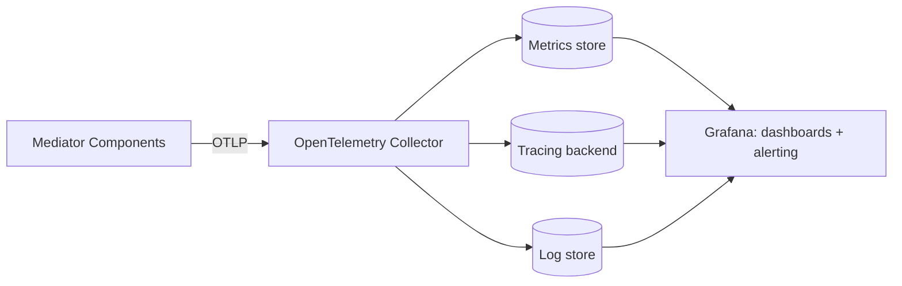

# Observability & Monitoring

To maintain and monitor the mediator in operation, every component is instrumented with **OpenTelemetry**, and **Grafana** is the visualization/alerting layer on top of it. This is a cross-cutting concern woven through every component (see [overview.md](overview.md)), not a separate business-logic service.

## Relationship to the Audit/Event Log

The mediator already keeps a durable, business-level **Audit/Event Log** (`SyncEvent`, see [data-model.md](data-model.md)) that other components depend on directly — it drives loop prevention and the landscape graph's activity metadata, and is retained long-term as the permanent record of what happened.

OpenTelemetry is a **separate, complementary layer**:

- The **Audit Log** answers "what happened, from a business perspective" (which mapping fired, which app was written to, was it a conflict) — and other mediator components read it back.
- **OpenTelemetry** answers "how is the system behaving, operationally" (latency, error rates, resource-level debugging) — for humans monitoring system health. It is not on the critical path of any business logic; the mediator functions correctly even if the telemetry pipeline is down.

Every `SyncEvent`/`AuditLog` entry carries a `traceId`/`spanId` (see [data-model.md](data-model.md)) so an operator can jump from a business record straight to the matching operational trace.

## Instrumentation

Every component — API/UI Layer, Spec Registry, Mapping Engine, Approval Service, Sync Engine (Webhook Receiver + Poller), Adapter Engine (Runtime + Planner), Graph Service — is instrumented with the OpenTelemetry SDK, emitting all three signal types:

### Traces

One trace per end-to-end operation: a registration, a mapping-detection run, a single sync execution, one adapter request. Spans mark each component hop — for example, an adapter request trace has spans for auth check, planning, each backend call, transform, and aggregation (see [adapter-engine.md](adapter-engine.md)).

### Metrics

- **Sync Engine**: success/failure/skipped-loop/skipped-policy/conflict rate per `SyncRule`; webhook delivery latency; poller lag (time since `lastRunAt` vs. expected interval); initial-backfill progress/duration; identity-resolution failure rate (no-match / ambiguous-match, see [sync-engine.md](sync-engine.md)).
- **Adapter Engine**: request rate/latency/error rate per `AdapterEndpoint`; cache hit rate; partial-failure/degraded-response rate.
- **Mapping Engine**: LLM call latency, error rate, and token/cost usage per provider; mapping review queue depth (pending / `reviewRequired` proposals); average confidence score trend.

### Logs

Structured logs correlated to the active trace/span, covering execution detail for debugging a specific run — without duplicating the Audit Log's business semantics. Logs answer "what happened inside this one execution"; the Audit Log answers "what happened to this business record, permanently."

## Pipeline

Components export telemetry via OTLP to an **OpenTelemetry Collector**, which routes traces/metrics/logs to whichever backing stores are configured (e.g. a Prometheus-compatible metrics store, a tracing backend such as Tempo/Jaeger, a log store such as Loki). The mediator's core code depends only on the OTel SDK/API — never a specific backend — keeping the observability stack swappable behind the Collector.

## Grafana dashboards

- **Landscape health** — per-app sync status, last successful sync time, error rate. A monitoring-oriented companion to the in-app [graph overview](../flows/graph-overview.md): Grafana shows operational health over time, the Graph Service shows current structural connections.
- **Sync engine** — webhook throughput/latency, poller lag per `SyncRule`, loop-prevention skip rate, conflict rate.
- **Adapter engine** — request rate/latency/error rate per `AdapterEndpoint`, cache hit rate, partial-failure/degraded-response rate.
- **Mapping engine** — LLM call latency/error rate/token usage per provider, proposals pending review, average confidence score trend.

## Alerting

Grafana alerting rules on top of the same metrics, covering conditions such as:

- A `SyncRule` has had no successful run past N× its expected interval (stuck poller or dead webhook subscription).
- An `AdapterEndpoint`'s error rate crosses a threshold.
- The mapping review queue is growing unbounded (proposals are not being reviewed fast enough).
- A candidate pair's mapping analysis has hit its retry ceiling and been marked `failed` (see [mapping-engine.md](mapping-engine.md)) — surfaced distinctly from a normal low-confidence proposal so it doesn't get lost in the review queue.
- **Any `AdapterBinding` transitions to `stale`** — alerted at a tighter threshold (e.g. immediately, vs. the `SyncRule` staleness alert which can tolerate more delay) since a stale binding is an active, externally-visible failure for a live caller right now, not a paused background job (see the asymmetry noted in [extensibility.md](extensibility.md) and [adapter-engine.md](adapter-engine.md)).
- An `AdapterEndpoint` has sat in `composition-required` longer than a threshold — a newly approved binding is waiting on a human composition decision while the endpoint serves its old configuration (see [flows/adapter-endpoint-composition.md](../flows/adapter-endpoint-composition.md)).
