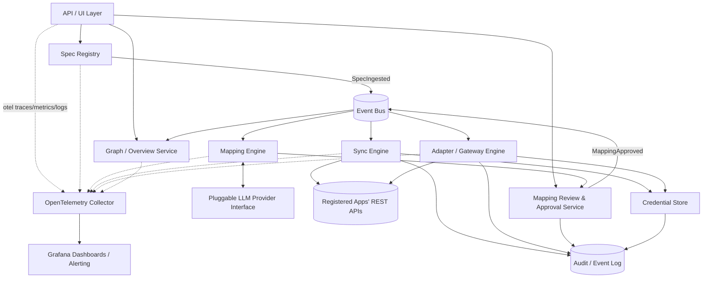

# Architecture Overview

## Purpose

The mediator sits in the middle of a software landscape of REST APIs (each described by an OpenAPI spec) and provides two capabilities on top of a shared foundation of spec ingestion and AI-assisted mapping:

1. **Cross-app data mapping & sync** — keep data consistent across independently-owned apps.
2. **Live adapter server generation** — let a newly introduced app describe what it needs from the landscape, and have the mediator serve that need immediately from real data.

Both capabilities are built on the same core idea: a **mapping** between two OpenAPI specs, detected with LLM assistance, reviewed and approved by a human, and then executed — either proactively (sync) or on demand (adapter).

## Components

| Component | Responsibility |
|---|---|
| **API/UI Layer** | Entry point for humans: registering apps, reviewing/approving mappings, viewing the landscape graph, viewing monitoring links. Credential material passes through it **write-only** at registration/rotation, straight into the Credential Store; secrets are never returned through this layer — the sole exception is a freshly *generated* adapter token, displayed once at issuance/rotation and stored only as a salted hash, so there is nothing retrievable to return later (see [security.md](security.md)). |
| **Spec Registry** | Stores raw OpenAPI documents and a normalized Intermediate Representation (IR: resources → operations → schemas). Owns spec versioning and diffing (see [extensibility.md](extensibility.md)). |
| **Credential Store** | Envelope-encrypted storage of per-app credentials (API keys, OAuth2 tokens, basic auth). Exposes only a scoped accessor that decrypts for the duration of a single outbound call — see [security.md](security.md). |
| **Mapping Engine** | LLM-based, provider-agnostic. Decomposes pairs of specs into a form suitable for LLM reasoning and proposes operation/field-level mappings with confidence scores. See [mapping-engine.md](mapping-engine.md). |
| **Mapping Review/Approval Service** | Turns a `MappingProposal` into an `ApprovedMapping`. Supports per-item edit/accept/reject and partial approval — nothing executes until approved. |
| **Sync Engine** | Executes approved peer-to-peer mappings on an ongoing basis by polling source apps for changes (Scheduler + Poller). See [sync-engine.md](sync-engine.md). |
| **Adapter/Gateway Engine** | Hosts live server endpoints for "consumer" specs (what a new app needs), resolving inbound requests on demand against one or more backend apps using approved mappings. See [adapter-engine.md](adapter-engine.md). |
| **Graph/Overview Service** | Maintains a materialized graph projection of the landscape (nodes = registered apps, edges = sync/adapter relationships) for the always-available overview. See [flows/graph-overview.md](../flows/graph-overview.md). |
| **Audit/Event Log** | Durable, business-level record of sync events, adapter calls, mapping decisions, and credential accesses. Drives idempotency deduplication (bounded event-history lookback) and the graph's activity metadata; loop prevention itself runs on `SyncFieldState`/`RecordLink` (see [sync-engine.md](sync-engine.md)). Distinct from operational telemetry (see [observability.md](observability.md)). |
| **Event Bus (internal)** | Decouples producers of state changes (`SpecIngested`, `MappingApproved`, sync writes) from the services that react to them (Sync Engine, Adapter Engine, Graph Service, cache invalidation). Durable, at-least-once delivery with idempotent consumers (deduplicating by event id); not a source of truth — every event is re-derivable from persisted state, and a periodic **reconciliation sweep** compares persisted state against what should have been derived from it (an ingested spec with no analysis run, an approved mapping with no rules/bindings/edge) and re-triggers the missing reaction. The sweep, not the bus's delivery guarantee alone, is what makes it true that bus loss degrades timeliness, never correctness. |
| **Observability / Telemetry** (cross-cutting) | Every component above is instrumented with OpenTelemetry (traces, metrics, logs), exported via a Collector to backing stores that Grafana visualizes. See [observability.md](observability.md). |

Two design points recur throughout the rest of this documentation:

- **The Sync Engine and Adapter Engine are both just consumers of `ApprovedMapping` data.** One pushes data proactively; the other resolves requests on demand. They share the same Transformation Executor, Outbound Call Executor, Credential Store access pattern, and Audit Log.
- **The Mapping Engine is used identically for both capabilities.** The differences are which spec pairs get analyzed (provider ↔ provider for sync candidates; consumer ↔ provider for adapter candidates) and the shape of the result: a peer-peer mapping carries one data direction (bidirectional sync is two mappings), while a consumer-provider mapping carries request- and response-phase transform sets for the adapter's round trip — the mediator never calls the consumer, so there is no reverse consumer-provider mapping (see [mapping-engine.md](mapping-engine.md) and [data-model.md](data-model.md)).

## Component diagram

## Key interfaces (informal contracts)

- `SpecRegistry.ingestSpec(appId, specDoc, role) -> ApiSpec` — app registration itself is an API/UI-layer orchestration: create the `RegisteredApp`, submit credential material write-only via `CredentialStore.store(appId, material)`, then ingest each spec document
- `SpecRegistry.diffSpec(appId, fromVersion, toVersion) -> SpecDiff`
- `MappingEngine.proposeMappings(sourceSpecRef, targetSpecRef) -> MappingProposal`
- `LLMMappingProvider.shortlistResourcePairs(shortlistContext) -> ResourceShortlist` — stage 1 of the pluggable AI abstraction: shortlists plausible resource pairs per spec pair (see [mapping-engine.md](mapping-engine.md))
- `LLMMappingProvider.generateMappingProposal(promptContext) -> MappingSuggestionSet` — stage 2: full detail analysis per shortlisted resource pair (see [mapping-engine.md](mapping-engine.md))
- `ApprovalService.updateItem(proposalId, itemId, edits)`, `.approve(proposalId, selection)`, `.reject(proposalId, itemIds)` — emits `MappingApproved(ApprovedMapping)`
- `CredentialStore.withCredential(appId, fn)` — the only way to use a credential; raw secrets never leave this scope
- `GraphService.getGraph(filter) -> { nodes, edges }`

## Deployment model

Single-tenant, self-hosted: one mediator instance manages one organization's landscape. There is no tenant-isolation concern in any component, which keeps the credential and auth model in [security.md](security.md) simpler than a multi-tenant SaaS would require.

**Availability** is stated explicitly rather than left implicit, because the mediator is not just a control plane: for consumer-only apps it *is* their API, and for sync it is the data plane between apps. The initial architecture accepts a single-instance deployment with supervised restart. Sync self-heals across downtime — polling resumes from cursors/snapshots, and state-convergent sync catches up on the next poll after restart — while adapter callers experience mediator downtime as unavailability of their endpoints. Components are stateless over a shared persistent store, so an active-passive standby can be added as a deployment choice without architectural change; full high availability is deliberately out of scope for the initial version.

## Outbound load discipline

The mediator is the busiest API client many landscape apps will ever have: polling, backfill enumeration, sync writes, and adapter fan-out all converge on the shared Outbound Call Executor. That executor enforces per-app concurrency and request-rate ceilings across *all* of this traffic and honors `429`/`Retry-After` with backoff. The poll interval bounds a single rule's steady-state read load; the per-app ceiling is what protects an app from the mediator's aggregate — a backfill running while three rules poll and an adapter endpoint fans out. These ceilings are operational configuration on the app registration, not per-rule review decisions.

## Scale assumption

The landscape is expected to be small (on the order of 15-20 registered apps), **each with a modest number of resource groups**. Even at this scale, exhaustive per-resource-pair analysis would explode in the wrong dimension: ~20 apps × ~10 resource groups each is a cross-product of tens of thousands of candidate resource pairs. The Mapping Engine therefore detects in two stages — a cheap summary-level *shortlist* call per spec pair, then a full *detail* call only for the resource pairs shortlisted as plausible (see [mapping-engine.md](mapping-engine.md)). That brings a full landscape pass to roughly a thousand LLM calls and, just as importantly, keeps the human review queue proportional to genuine correspondences rather than to the cross-product. The assumption still has limits: shortlist cost grows quadratically with app count (one call per spec pair), and very large per-spec resource counts grow the summary prompt itself — either growing substantially is the trigger to revisit (e.g. batching shortlist calls, or adding a non-LLM pre-filter in front of stage 1). The second driver has a zero-machinery mitigation where it is knowable in advance: operator analysis-scope exclusions (`ApiSpec.analysisExclusions`, see [mapping-engine.md](mapping-engine.md)) keep a very large spec from sending resource groups through stage 1 that the operator already knows the landscape doesn't use.
