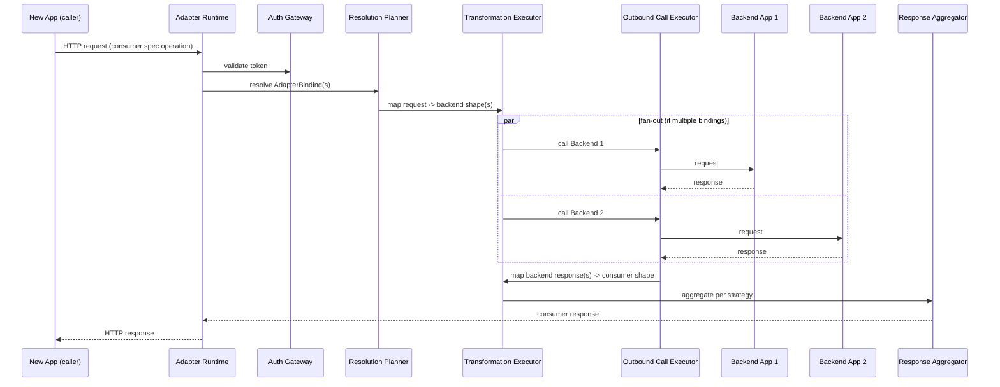

# Flow: Live Adapter Server Handling an Inbound Request

Executed by the [Adapter/Gateway Engine](../architecture/adapter-engine.md) whenever a newly introduced app calls its generated adapter server.

## Steps

1. An inbound HTTP request hits the Adapter Server Runtime at the path bound to a consumer operation.
2. The Auth Gateway validates the caller's mediator-issued adapter token (see [architecture/security.md](../architecture/security.md)).
3. The Request Router matches the operation to its `AdapterEndpoint`.
4. The Resolution Planner loads the endpoint's persisted `AdapterBinding`(s) (primary/fallback/supplement) and their `ApprovedMapping`s, re-validating that none are `stale` — a stale binding fails as a distinct `mapping-stale` error rather than a generic upstream error (see [architecture/adapter-engine.md](../architecture/adapter-engine.md)).
5. The Transformation Executor maps the inbound request's params/body to each backend's expected shape.
6. The Outbound Call Executor calls the backend app(s) grouped by `executionOrder` — bindings sharing an order run in parallel; a binding with `dependsOnBindingId` set runs only once that binding's response is available and receives it as input.
7. The Transformation Executor maps each backend response back to the consumer's schema.
8. The Response Aggregator merges/aggregates results per the endpoint's `aggregationStrategy` (`single` / `fanout-merge` / `collection-union` / `fanout-first-success`), applying the configured error/partial-failure semantics.
9. The response is validated against the consumer OpenAPI response schema and returned; the response cache is updated if `cacheTtl` is set. A validation failure fails the request with a distinct `mediator-transform-error` — a mediator-side mapping defect, never returned as if it were valid data (see error semantics in [architecture/adapter-engine.md](../architecture/adapter-engine.md)).

## Sequence diagram

## Notes

- Bindings are resolved from persisted state, not re-planned from scratch on every request — see [architecture/adapter-engine.md](../architecture/adapter-engine.md) for why this favors predictability/performance. Only `active` bindings participate; an endpoint sitting in `composition-required` keeps serving its previous active configuration, and a consumer operation with no approved binding at all returns a distinct `not-yet-mapped` error (see [adapter-endpoint-composition.md](adapter-endpoint-composition.md)).
- Write operations follow stricter rules — always a `single` binding, idempotency-key treatment, no caching — see *Write operations* in [architecture/adapter-engine.md](../architecture/adapter-engine.md).
- A cache hit at step 4/5 (per `(adapterEndpointId, normalized params)`) can short-circuit the backend calls entirely; cache entries are invalidated by the same `SyncEvent`s the Sync Engine produces for the underlying resources.
- Each inbound request is traced end-to-end (auth → planning → each backend call → transform → aggregation) via OpenTelemetry — see [architecture/observability.md](../architecture/observability.md).
