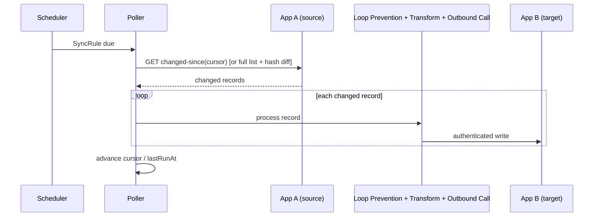

# Flow: Data Sync via Polling Pull

Executed by the [Sync Engine](../architecture/sync-engine.md) whenever a source app declares `supportsPolling` on its `SyncRule` (either as its only transport, or as a safety net alongside webhooks).

## Steps

1. The Scheduler wakes a `SyncRule` when its polling interval (`pollIntervalOverride` or the app's `defaultPollInterval`) elapses.
2. The Poller calls App A's changed-since operation using the `SyncRule.cursor`, if App A's API supports delta queries. If it doesn't, the Poller does a full fetch and diffs the result against the last-seen snapshot by content hash.
3. For each changed record, the same shared pipeline as webhook push runs: Loop Prevention → Transformation Executor → Outbound Call Executor (see [sync-webhook-push.md](sync-webhook-push.md) for the pipeline detail).
4. `SyncRule.cursor` and `lastRunAt` are advanced once all changed records for this run have been processed; a `SyncEvent` is recorded per record.

## Sequence diagram

## Notes

- Polling is also useful as a supplementary safety net alongside webhooks for an app that supports both — it catches any change whose webhook delivery was missed or failed.
- Poller lag (time since `lastRunAt` vs. the expected interval) is tracked as an OpenTelemetry metric and surfaced on the Sync Engine Grafana dashboard — see [architecture/observability.md](../architecture/observability.md).
