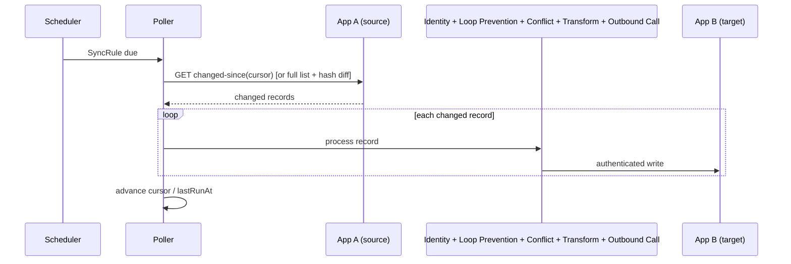

# Flow: Data Sync via Polling Pull

Executed by the [Sync Engine](../architecture/sync-engine.md) for every `SyncRule` whose `transport` includes poll — available when the rule's source app declares `supportsPolling` in its `capabilities` (either as its only transport, or as a safety net alongside webhooks).

## Steps

1. The Scheduler wakes a `SyncRule` when its polling interval (`pollIntervalOverride` or the app's `defaultPollInterval`) elapses.
2. The Poller calls the source operation pinned by `SyncRule.pollOperationRef` (see [architecture/data-model.md](../architecture/data-model.md)): App A's delta-query operation with the stored `SyncRule.cursor` when App A declares `supportsDeltaQuery`, otherwise the collection read — paged to exhaustion via the operation's IR-declared pagination parameters — diffing the result against the last-seen snapshot by content hash. A record missing from a **complete** fetch is a delete candidate (handled per `SyncRule.deletePropagation`); a truncated or partially failed fetch aborts the run rather than misreading missing pages as deletions — see *Change types* in [architecture/sync-engine.md](../architecture/sync-engine.md).
3. For each changed record, the same shared pipeline as webhook push runs: Identity Resolution → Loop Prevention → Conflict Detection → Transformation Executor → Outbound Call Executor (see [sync-webhook-push.md](sync-webhook-push.md) for the pipeline detail).
4. `SyncRule.cursor` and `lastRunAt` are advanced once all changed records for this run have been processed; a `SyncEvent` is recorded per record.

## Sequence diagram

## Notes

- A newly enabled `SyncRule` does not start polling until its one-time initial backfill has completed or been explicitly skipped — see *Initial backfill* in [architecture/sync-engine.md](../architecture/sync-engine.md).
- Polling is also useful as a supplementary safety net alongside webhooks for an app that supports both — it catches any change whose webhook delivery was missed or failed.
- Poller lag (time since `lastRunAt` vs. the expected interval) is tracked as an OpenTelemetry metric and surfaced on the Sync Engine Grafana dashboard — see [architecture/observability.md](../architecture/observability.md).
